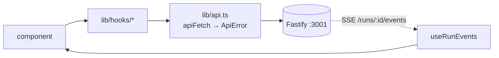

# client — UI architecture

How `@devdigest/web` is wired: where the Server/Client boundary falls, how data
reaches a component, and which conventions exist for reasons that are not
obvious from reading one file. The route → API map lives in
[`../README.md`](../README.md); the per-route contract in
[`../specs/pages.md`](../specs/pages.md).

## The Server/Client boundary

Next 15 App Router, but the server half is deliberately thin. Only the root layout
and the thin route entries are Server Components:

| File | Why it stays on the server |
|---|---|
| `app/layout.tsx` | awaits `getLocale()` / `getMessages()` from `next-intl/server`, so the message bundle is embedded in the first HTML instead of fetched after hydration |
| every `page.tsx` (`agents`, `agents/[id]`, `settings/[section]`, `repos/[repoId]/pulls`, `…/pulls/[number]`) | a route entry that only renders a client `<X>View` from `_components/`; the `"use client"` boundary sits on the view |

Every view (and the pages that have not been thinned yet) is `"use client"`, because each one owns interaction state and
TanStack queries against a separate API origin. There is no server-side data
fetching and no server action anywhere: the Fastify engine is a different
process on a different port, reached from the browser.

Two details in `layout.tsx` are load-bearing:

- **`themeNoFlashScript` runs before paint** (`dangerouslySetInnerHTML` in
  `<head>`) so the stored theme is applied before first paint. Moving it into a
  component reintroduces a flash of the wrong theme.
- **`suppressHydrationWarning` sits on `<body>`**, not on an ancestor, because
  browser extensions inject attributes onto `<body>` before React hydrates. It
  suppresses one element's own attribute mismatch; real mismatches in descendants
  are still reported.

## The app shell

`app/(shell)/layout.tsx` renders `ShellLayout` (`components/app-shell`) once for
`/`, `/repos/**`, `/agents/**` and `/settings/**`; `/onboarding` is outside the
group and has no shell. Because the shell is a layout it is **not** remounted on
navigation. A view declares its breadcrumb with `useCrumb([...])`
(`components/app-shell/crumb.tsx`); it is set in a layout effect and cleared on
unmount. Do not render `<AppShell>` from a page.

`repos/[repoId]/layout.tsx` wraps every repo-scoped page in `RepoGuard`: an unknown
`:repoId` renders the "no repo selected" state once, so pages do not repeat the
check. `app/error.tsx` is the last-resort boundary for render errors.

## Provider stack

`lib/providers.tsx`, mounted once inside the layout's `<Suspense>`:

```
QueryClientProvider → ThemeProvider → ToastProvider → RepoProvider
```

`QueryClient` defaults: `retry: 1`, `staleTime: 30s`, `refetchOnWindowFocus:
false`. A local-first tool talking to localhost does not need aggressive
refetching, and the PR list opts into its own polling interval where it matters.

### Error-UX taxonomy

Errors are surfaced globally, but not uniformly — that asymmetry is the point:

- **Mutations always toast.** A mutation is a user action; silence would read as
  "nothing happened".
- **Queries toast only on network failure or 5xx.** An expected 4xx — a 404 for
  a resource that does not exist yet — stays silent so the component can render
  an inline empty state instead of shouting.
- **`ApiError` carries `status`, `code`, `details`**, which is what lets the
  above branch. It is produced in one place (`lib/api.ts`); calling `fetch`
  directly from a component bypasses the normalisation and the taxonomy with it.

A third channel exists for live runs: SSE `error` events never pass through
TanStack's error handling, so `useRunEvents` toasts them itself (below).

## Data flow



`apiFetch` sets `content-type: application/json` **only when a body is actually
present**. A body-less POST that declares the header trips Fastify's "Body cannot
be empty when content-type is application/json" — which is why the helpers build
the header conditionally rather than always.

### Cache keys

One key per resource, so an invalidation in one hook reaches every consumer.
Every key is built by the factory in `src/lib/hooks/keys.ts` (`keys.pulls(repoId)`,
…) — never write a `queryKey: [...]` literal. Also cached: `["pr-comments", prId]`.

| Key | Endpoint | Notes |
|---|---|---|
| `["repos"]` | `GET /repos` | |
| `["pulls", repoId]` | `GET /repos/:id/pulls` | refetches on an interval and on focus |
| `["pull", prId]` | `GET /pulls/:id` | |
| `["reviews", prId]` | `GET /pulls/:id/reviews` | reviews **with findings embedded** |
| `["pr-runs", prId]` | `GET /pulls/:id/runs` | polls while anything is `running` |
| `["pr-active-runs", prId]` | `GET /pulls/:id/runs/active` | server-sourced live state |
| `["run-trace", runId]` | `GET /runs/:id/trace` | |
| `["agents"]`, `["agent", id]` | `/agents` | |
| `["provider-models", provider]` | `/providers/:id/models` | |
| `["settings"]`, `["secrets-status"]` | `/settings*` | |
| `["repo-intel-state", repoId]` | `/repos/:id/index-state` | polls while indexing |
| `["context", repoId]` | project-context files | |

Because `["reviews", prId]` is shared, a component that only needs a preview of a
PR's findings can subscribe lazily and be served from the same cache the detail
page fills — no second endpoint, and no risk of the two disagreeing.

### Live runs

`useRunEvents(runIds)` opens one `EventSource` per in-flight run against
`/runs/:id/events`. Three things in it are deliberate:

- it listens to **both** `onmessage` and the named events (`info`, `tool`,
  `result`, `error`), because servers and clients disagree about whether a
  `kind`-tagged event also arrives as a default message;
- non-JSON frames are swallowed (keepalives);
- `kind === "error"` is toasted explicitly, since a runtime agent failure arrives
  as an SSE payload and never reaches the query/mutation error handlers.

Live status is still **server-sourced**: `usePrActiveRuns` reads
`agent_runs.status='running'` so the UI survives a reload or a second device, and
self-clears by polling when runs finish. SSE is for progress, not for truth.

## Component conventions

- **Pages are thin.** A `page.tsx` resolves params and renders a view; feature
  logic lives in colocated `_components/<Name>/` folders, each with its own
  `styles.ts`, `constants.ts`, `helpers.ts` and `*.test.tsx`.
- **Three tiers of component.** `src/vendor/ui` (`@devdigest/ui`) is the vendored
  kit — primitives, kit widgets, charts, shell — and is **do-not-touch**;
  `src/components/*` holds app-level shared pieces (`app-shell`, `page-shell`,
  `diff-viewer`, `findings-preview`, `mermaid-diagram`, `repo-not-found`,
  `showcase`); everything else is colocated under a route.
- **No second UI library.** If a primitive is missing, the shared tier is where
  it goes — not a new dependency.
- **Every user-facing string goes through next-intl**, namespaced by filename
  under `messages/<locale>/`. Namespaces exist for features that are not built
  yet; they are placeholders for later lessons, not dead files.
- **Styling is inline style objects** in colocated `styles.ts`, over CSS
  variables defined by the kit's tokens — not Tailwind classes, despite Tailwind
  being present for globals.

### A trap worth knowing before you place an overlay

Both the PR table and the run timeline sit inside containers with
`overflow: hidden`. A popover positioned `absolute` inside a row is clipped away
rather than overlaying the page. The working shape is `position: fixed`,
anchored from the trigger's `getBoundingClientRect()` and clamped to the
viewport — while still being rendered as a **DOM child of its trigger**, so
moving the pointer onto the card does not fire the trigger's `mouseleave`.
`src/components/findings-preview/` implements both halves.

## Contracts

`src/vendor/shared` is a **separate copy** of the zod contracts. The canonical
home is `server/src/vendor/shared`, and the two have already drifted in several
files. A contract change means editing both; verifying it means diffing the
files you touched, not the whole directory — a full `diff -r` is permanently
noisy and hides the one file that matters.

## Tests

vitest + jsdom, colocated `*.test.tsx`. `fetch` is not globally mocked — tests
mock the **hook module** (`vi.mock("@/lib/hooks/reviews", …)`) or
`next/navigation`, and wrap the subject in `NextIntlClientProvider` with the real
message bundle so a missing i18n key fails the test. Full policy:
[`../../TESTING.md`](../../TESTING.md).
