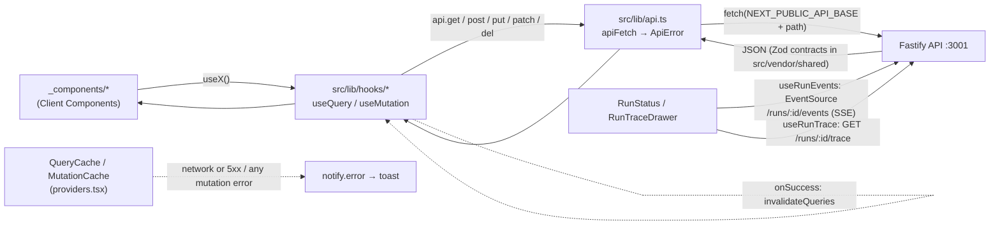

# UI architecture (`@devdigest/web`)

How the studio UI is put together: Next.js 15 App Router, React 19, TanStack
Query, next-intl, and the vendored `@devdigest/ui` design system. Every path
below is relative to `client/`. Route-by-route behaviour is in
[`../specs/pages.md`](../specs/pages.md).

## Server / Client boundary

`src/app/layout.tsx` is the only async Server Component. It calls
`getLocale()` / `getMessages()` from `next-intl/server`, imports
`./globals.css`, sets `data-theme="dark"` and `data-density="regular"` on
`<html>`, injects `themeNoFlashScript` (from `src/lib/theme.tsx`) into `<head>`
so the stored theme is applied before paint, and wraps children in
`NextIntlClientProvider` and `Providers`.

Everything that fetches data or holds state is a Client Component. The route
files split into two shapes:

| Route file | `"use client"` | Why |
|---|---|---|
| `src/app/page.tsx` | yes | calls `useRepos` and `router.replace` |
| `src/app/onboarding/page.tsx` | yes | renders `AddRepoView` only |
| `src/app/repos/[repoId]/pulls/page.tsx` | yes | owns filter state and `?status` |
| `src/app/repos/[repoId]/pulls/[number]/page.tsx` | yes | owns `?tab` / `?trace` and the run hooks |
| `src/app/agents/[id]/page.tsx` | yes | owns `?tab` and the agent list column |
| `src/app/agents/page.tsx` | no | returns `<AgentsListView />`, a client component |
| `src/app/settings/[section]/page.tsx` | no | returns `<SettingsView />`, a client component |

Route files stay thin: they wire URL params to hooks and hand data to
colocated `_components/`. There are no `loading.tsx`, `error.tsx` or
`not-found.tsx` files; loading and error states are rendered inline by each
page with `Skeleton`, `ErrorState` and `EmptyState`.

## Provider stack (`src/lib/providers.tsx`)

```
QueryClientProvider > ThemeProvider > ToastProvider > RepoProvider > page
```

- **React Query.** One `QueryClient` per mount with `retry: 1`,
  `staleTime: 30_000`, `refetchOnWindowFocus: false`. Individual hooks override
  these where they need to (`usePulls` refetches every 60 s and on focus;
  `usePrActiveRuns` / `usePrRuns` poll every 4 s while a run is `running`;
  `useRunTrace` has `retry: false`).
- **Toast policy.** `QueryCache.onError` toasts only when the error is a
  network failure (`ApiError.status === 0`) or a 5xx; 4xx stays silent so
  pages can show inline empty states. `MutationCache.onError` toasts on every
  failure. Toasts go through the module-level `notify` bridge in
  `src/lib/toast.tsx`, which the mounted `ToastProvider` registers itself with.
- **Theme.** `ThemeProvider` (`src/lib/theme.tsx`) reads the `data-theme`
  attribute on mount, writes it back on `set`, and persists to
  `localStorage["dd-theme"]`. All colours are CSS variables switched by
  `[data-theme="dark|light"]` in `src/vendor/ui/styles.css`.
- **Active repo.** `RepoProvider` (`src/lib/repo-context.tsx`) resolves the
  active repo as URL path `/repos/:repoId` > `localStorage["dd-repo"]` > first
  repo from `useRepos`. `useRepoNotFound(repoId)` is true only once repos have
  loaded and none matches; repo-scoped pages render `RepoNotFound` instead of
  a 404.
- **i18n.** `next-intl` with a single locale. `src/i18n/request.ts` merges
  every `messages/en/<ns>.json` into one namespace map, so components call
  `useTranslations("prReview")`, `useTranslations("runs")`, and so on.

## Data flow



Rules that the code enforces:

- Components never call `fetch`. They call a hook from `src/lib/hooks/*` (one
  file per domain: `core.ts`, `agents.ts`, `reviews.ts`, `trace.ts`,
  `repo-intel.ts`, all re-exported by `hooks/index.ts`).
- `apiFetch<T>(path, init)` prefixes `API_BASE`
  (`process.env.NEXT_PUBLIC_API_BASE ?? "http://localhost:3001"`, the only env
  the client reads). It sets `content-type: application/json` **only when a
  body is present**; a body-less POST/PUT with that header makes Fastify reply
  "Body cannot be empty". A `204` resolves to `undefined`.
- Failures become `ApiError { status, code?, details? }`. A thrown `fetch`
  (API down) is `status 0`, `code "network_error"`. Non-2xx responses read
  `body.error.{code,message,details}` when the body is JSON.
- Mutations invalidate the list they affect in `onSuccess` (for example
  `useAddRepo` invalidates `["repos"]`, `useDeleteRun` invalidates
  `["pr-runs", prId]` and `["reviews", prId]`).

## Component conventions

Feature code lives next to its route in `_components/<Name>/`:

| File | Content |
|---|---|
| `<Name>.tsx` | the component, `"use client"` |
| `index.ts` | the only import surface (`export { Name } from "./Name"`) |
| `styles.ts` | inline `CSSProperties` objects exported as `s`, colours via `var(--…)` |
| `constants.ts` | magic values, i18n key tables, grid templates |
| `helpers.ts` | pure functions (`sizeOf`, `relativeTime`, `visibleFindings`) |
| `<Name>.test.tsx` | React Testing Library test with a mocked `fetch` |

Nested pieces go one level deeper (`RunTraceDrawer/_components/TraceBody`).
Cross-page pieces live in `src/components/` (`app-shell`, `diff-viewer`,
`page-shell`, `repo-not-found`, `run-cost-badge`, `showcase`,
`mermaid-diagram`). Page-level constants for the PR list sit directly in
`src/app/repos/[repoId]/pulls/{constants,helpers,styles}.ts`.

## App shell

`src/components/app-shell/AppShell.tsx` wraps every page in the design
system's `AppFrame` (sidebar + topbar + `<main>`) and mounts `CommandPalette`
and `ShortcutsHelp`. Its hooks:

- `useShellContext` builds the `ShellContext` the frame needs: active nav key
  (`activeKeyFor(pathname)`), repos mapped by `toShellRepo`, theme toggle, the
  sidebar badge (`prCount` = PRs with `status === "needs_review"`), and repo
  select / add / remove actions (`useDeleteRepo`, then navigate to the next
  repo or `/onboarding`).
- `useGlobalShortcuts` binds Cmd/Ctrl+K (palette), `?` (help) and `g` then a
  key within `G_NAV_TIMEOUT_MS` (1200 ms): `g p` pulls, `g a` agents, `g ,`
  settings, from `NAV` / `SETTINGS_ITEM` in `src/vendor/ui/nav.ts`.
- `useShellCommands` turns the same `NAV` table plus Settings and a theme
  toggle into palette commands.

## Design system (`@devdigest/ui`)

`src/vendor/ui` is aliased as `@devdigest/ui` in `tsconfig.json` and
`vitest.config.ts`; import from the barrel `index.ts` only. Layers, per
`src/vendor/ui/README.md` and the barrel: `primitives/` (Button, Badge,
SeverityBadge, CategoryTag, EmptyState, ErrorState, Skeleton, …), `kit/`
(Drawer, Modal, Tabs, Dropdown, form inputs), `charts/`, `shell/` (AppFrame,
Sidebar, Topbar, RepoSwitcher), `command-palette/`, `icons.tsx` (`Icon`
registry, `IconName`), `nav.ts`, and three standalone files (`LiveLogStream`,
`ExportWizardSteps`, `AutoTriggerStatus`).

Tokens live in `primitives/tokens.ts`: `SEV[severity]` gives `{ c, bg, icon,
label }` for `CRITICAL | WARNING | SUGGESTION | INFO`, `CAT[category]` gives
`{ icon, label }` for `bug | security | perf | style | test`. Prefer
`SeverityBadge` / `CategoryTag` over reading the maps.

`src/components/showcase/Showcase.tsx` exports `Gallery`, which renders every
component (including `RunCostBadge`). `src/app/showcase/page.tsx` serves it at
`/showcase` in the current theme, and `src/test/smoke.test.tsx` mounts the same
gallery in both themes, so a broken export fails `pnpm test`. Adding a new
component to `Gallery` is the rule.

## Shared contracts (`@devdigest/shared`)

`src/vendor/shared` is a copy of `server/src/vendor/shared`, aliased as
`@devdigest/shared`. Hooks type their responses with it (`PrMeta`,
`RunSummary`, `ReviewRecord`, `RunTrace`, `Agent`) and `src/lib/types.ts`
re-exports the platform subset. The rule from the root `AGENTS.md`: edit the
server copy, then copy the changed file over; never edit the client copy. As
of this writing `diff -rq` shows five files still drifted (`adapters.ts`,
`eval-ci.ts`, `knowledge.ts`, `platform.ts`, `productionize.ts`); `trace.ts`
and the other contracts match.

## Live runs vs persisted trace

Two hooks cover a run's lifetime:

- `useRunEvents(runIds)` (`hooks/reviews.ts`) opens one `EventSource` per run
  at `${API_BASE}/runs/:id/events`, listens for `info | tool | result | error`
  events plus default messages, accumulates `RunEvent[]`, and reports
  `running` until every stream closes. SSE `error` events are toasted here
  because they never pass through React Query.
- `useRunTrace(runId, enabled)` (`hooks/trace.ts`) fetches the persisted
  `RunTrace` document (`GET /runs/:id/trace`): config, stats (duration,
  tokens, `cost_usd`, findings), prompt assembly, tool calls, raw output, log.

Which runs are live is decided by the server, not by client state:
`usePrActiveRuns` (`GET /pulls/:id/runs/active`) polls while non-empty, and
`usePrRuns` (`GET /pulls/:id/runs`) polls while any row is `running`.

## PR detail composition

`src/app/repos/[repoId]/pulls/[number]/page.tsx` resolves the route's PR
number to the row uuid through the cached `usePulls(repoId)` list, then loads
`usePullDetail(prId)`, `usePrReviews`, `usePrActiveRuns`, `usePrRuns`. URL
params are the only tab state: `?tab=overview|findings|diff` (default
`overview`) and `?trace=<runId>` open the drawer; both are written with
`router.replace` via `setParam`.

- `PrDetailHeader` renders title, branch, status, the `Tabs` and
  `RunReviewDropdown` (POST `/pulls/:id/review`, then switches to the
  findings tab and invalidates `["pr-active-runs", prId]`).
- `FindingsTab` (the "Agent runs" tab) stacks: a **Live review** block
  (`RunStatus` → `useRunEvents` → `LiveLogStream`, with Cancel via
  `useCancelRun`) while `liveRunIds` is non-empty; the **Timeline**
  (`RunHistory`: `RunSummary[]` interleaved with `pr.commits`, newest first,
  full `RunCostBadge` on settled runs, trace and delete buttons); and
  **Review runs** (one `ReviewRunAccordion` per `ReviewRecord`, first open,
  holding `VerdictBanner` and `FindingsPanel` → `FindingCard` with
  `j`/`k`/`a`/`d` keys via `useFindingAction`). Clicking an agent name in the
  timeline scrolls to and opens the matching accordion (`targetRunId` +
  nonce).
- `RunTraceDrawer` mounts when `?trace` is set. The page does not pass
  `running`, so the drawer opens on its Trace tab and reads the persisted
  trace; its Live log tab shows `trace.log`. It joins the run's findings and
  agent name from the `reviews` list by `run_id`.
- `DiffTab` renders `DiffViewer` with `usePrComments` /
  `useCreatePrComment` (GitHub review comments, allowed only on open PRs).

## Tests

`vitest.config.ts`: jsdom, `globals: true`, setup in `src/test/setup.ts`
(jest-dom matchers, a `ResizeObserver` stub), include `src/**/*.test.{ts,tsx}`.
Thirteen test files exist today: colocated component tests (PRRow, FindingCard,
FindingsPanel, RunHistory, RunReviewDropdown, RunStatus, RunTraceDrawer,
VerdictBanner, AgentCard, AgentEditor), `RunCostBadge.test.tsx`,
`format-cost.test.ts`, and the smoke test. Browser journeys live in
`../e2e/specs/*.flow.json`.
