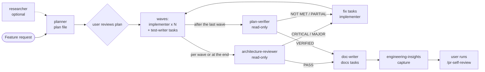

# Quality and docs agents (test-writer, architecture-reviewer, plan-verifier, doc-writer) — Development Plan

Date: 2026-09-25 · Branch: feature/l02-quality-and-docs-agents (to confirm, see Open questions Q5) · Status: done

## Goal

Four new project subagents in `.claude/agents/` close the loop after the
implementers: `test-writer` adds tests by the repo's test policy, `architecture-reviewer`
checks layer boundaries read-only with evidence, `plan-verifier` checks finished
code against every item of a plan, and `doc-writer` turns a shipped feature into
documentation in the right place. The execution protocol in `docs/plans/README.md`
and the agent map in `.claude/agents/README.md` say when each one runs.

## Context

- Request: create four subagents (test-writer, architecture-reviewer,
  plan-verifier, doc-writer); the user reviews this plan before any agent file
  exists; sources for every practice must be in the plan.
- Area: **root config** (`.claude/agents/**`, `docs/plans/README.md`). No package
  code changes; no `server/`, `client/`, `reviewer-core/`, `e2e/` file is edited.
- Existing agents followed: `.claude/agents/researcher.md` (read-only agent,
  fixed report, status vocabulary), `.claude/agents/planner.md` (explicit
  `Skill` calls, checklist workflow), `.claude/agents/implementer.md` (one task,
  own files only, report block, `DONE | DONE_WITH_CONCERNS | NEEDS_CONTEXT | BLOCKED`).
- Shared references the new agents must **reuse, not copy**:
  - `.claude/skills/pr-self-review/references/routing.md` — the only skill →
    section map (see `.claude/agents/README.md` › Shared rules › One skill map).
  - `.claude/skills/pr-self-review/references/severity.md` — the one severity
    scale (CRITICAL / MAJOR / MINOR / NIT, codes C1–C13, the CRITICAL
    verification steps).
  - `.claude/skills/pr-self-review/references/reviewer-brief.md` — the finding
    shape (`severity, code, file, line, also, rule, problem, failure_scenario, fix`)
    and the "Do not report" list.
  - `.claude/skills/pr-self-review/scripts/precheck.sh` — deterministic checks;
    it writes only to its own `mktemp -d` directory (`precheck.sh:33-34`), so a
    read-only agent may run it.
  - `TESTING.md` — typological test policy.
- INSIGHTS entries that apply (attached to the task they constrain):
  - root — "The installed pnpm (12.4.2) rejects `-s`" → every command in the
    agent files uses `pnpm run <script>` (T001, T002, T003).
  - root — "`server` typecheck fails inside `../reviewer-core` when reviewer-core
    has no `node_modules`" → architecture-reviewer and plan-verifier must not
    read that error as a defect of the diff (T002, T003).
  - root — "`diff -r` over the two `vendor/shared` copies is NOT a drift gate" →
    compare only touched contract files (T002, T003, T004).
  - root — "The installed zod 3.25 exports `zod/v4`" → Zod 4 is a grep check,
    not a typecheck; out of the architecture-reviewer's scope, owned by precheck
    `zod-3-only` (T002).
  - server — "Half the modules do NOT follow the documented routes → service →
    repository anatomy" → a neighbour's shape is not the convention for the
    test-writer or the reviewer; existing inline queries are known debt, not
    findings (T001, T002).
  - server — "`arch:check`'s baseline pins the pnpm store path" and "Copying
    `agents/helpers.ts`'s `import type {XRow}` shape trips `no-circular`" →
    architecture-reviewer interprets `arch:check` output with these (T002).
  - server — "Test fire-and-forget review behaviour by INSERTING runs" and
    "`pnpm exec vitest run .it.test` is flaky in a sandboxed shell"
    (Confidence: low) → test-writer rules (T001).
  - client — "Moving a component folder breaks `vi.mock("../../…")`" (mock with
    the `@/` alias), "jsdom's `File` has no `arrayBuffer()`", and "CLOSED: the
    `client/CLAUDE.md` vs `TESTING.md` test-policy conflict" (a component folder
    without a test is not a defect) → test-writer rules (T001).
- Spec invariants that apply: none (no package spec covers agents).
- Closest existing feature followed: the researcher / planner / implementer set
  and its map `.claude/agents/README.md`.
- External research used (cited in *Sources*): four researcher reports on
  test-writer, architecture-reviewer, plan-verifier and doc-writer practices,
  including a verified map of this repo's docs layout.

## Scope

- In:
  - four agent files: `.claude/agents/{test-writer,architecture-reviewer,plan-verifier,doc-writer}.md`;
  - `.claude/agents/README.md`: the four agents in the map, the new flow, the
    new sources;
  - `docs/plans/README.md`: where the four agents run in the execution protocol,
    and an `Agent:` field in the task template;
  - `.claude/skills/README.md` › Agents: the agent list line (pending Q4);
  - one smoke test per agent, run by the main session, nothing committed from it.
- Out:
  - edits to `planner.md` / `implementer.md` (pending Q4 — the planner already
    follows the template in `docs/plans/README.md`, so the new `Agent:` field
    reaches it without an edit);
  - hooks or `settings.json` rules that enforce write scopes (the agents enforce
    them by rule, like the implementer does);
  - changes to `pr-self-review` (its references are reused as-is);
  - any `INSIGHTS.md` entry (the main session captures insights at the end, via
    `engineering-insights`);
  - Mutation-testing tooling (Stryker); the mutation check is manual.

## Design

### Where each agent sits in the flow



- **test-writer runs inside the waves**, as a peer of the implementer. A plan
  task carries `Agent: test-writer` when its deliverable is tests only. The main
  session dispatches it exactly like an `implementer` task (same wave rules,
  same exclusive file ownership, same one-commit-per-task).
- **architecture-reviewer and plan-verifier run after the waves**, in parallel
  (both are read-only, so they cannot collide). architecture-reviewer may also
  run after any single wave when the plan is large. Their findings become fix
  tasks for implementers; the loop repeats until both pass.
- **doc-writer runs last**, after both checks pass, so it documents what
  actually shipped. A plan can also carry `Agent: doc-writer` tasks in its final
  wave (the planner's "Wave 2 — integration: … docs/specs updates").
- `/pr-self-review` stays the user's gate before any push; architecture-reviewer
  does not replace it (pr-self-review covers every skill on the whole diff and
  is not model-invocable; architecture-reviewer is narrower and runs earlier).

### Contracts (the shared vocabulary — designed first)

These are the "contracts" of this change: the frontmatter shape, the status
vocabularies, and the plan-template field. Every task below uses them verbatim.

**Frontmatter** (same fields as the existing three agents):
`name`, `description` (says when to use it and what to pass), `model`, `tools`.
No `skills:` field — skills are loaded by explicit `Skill` calls
(`.claude/agents/README.md` › Shared rules). `permissionMode` is **not** set on
any of the four; read-only is enforced by the `tools` list (see Q3 for the
alternative and its risk).

| Agent | model | tools | Writes |
|---|---|---|---|
| test-writer | sonnet | `Read, Edit, Write, Grep, Glob, Bash, Skill` | test files its task owns |
| architecture-reviewer | opus | `Read, Grep, Glob, Bash, Skill` | nothing |
| plan-verifier | opus | `Read, Grep, Glob, Bash` | nothing |
| doc-writer | sonnet | `Read, Edit, Write, Grep, Glob, Bash, Skill` | documentation paths only |

Model choice: the two writers do bounded, rule-following work like the
implementer (sonnet); the two judges must resist rubber-stamping and LLM-judge
biases on large diffs, so they get the stronger model (opus), like the planner.
No agent gets `Agent` (no nested spawning — `.claude/agents/README.md` › Sources).

**Status vocabularies**

| Agent | Status line | Meaning |
|---|---|---|
| test-writer | `DONE \| DONE_WITH_CONCERNS \| NEEDS_CONTEXT \| BLOCKED` | same as implementer; a test that exposes a real production defect → `BLOCKED` with `Defect found:` and the failing test left in the tree, uncommitted |
| architecture-reviewer | `PASS \| BLOCKED \| NEEDS_CONTEXT` | `BLOCKED` = at least one confirmed CRITICAL per `severity.md`; MAJOR/MINOR/NIT never block, same as pr-self-review |
| plan-verifier (item verdicts) | `MET \| PARTIAL \| NOT MET \| UNVERIFIABLE` | **our own vocabulary** — the research found no standard one (superpowers uses ✅/❌/⚠️ "Cannot verify"; spec-kit has none for code). `UNVERIFIABLE` must say what would verify it; the orchestrator resolves it |
| plan-verifier (overall) | `VERIFIED \| GAPS \| NEEDS_CONTEXT` | `VERIFIED` = every item MET; `GAPS` = any PARTIAL / NOT MET / UNVERIFIABLE |
| doc-writer | `DONE \| DONE_WITH_CONCERNS \| NEEDS_CONTEXT \| BLOCKED` | same as implementer |

**Plan template field** (added to `docs/plans/README.md` by T005):
`- Agent: implementer | test-writer | doc-writer` on every task, default
`implementer` when omitted, so older plans stay valid. architecture-reviewer and
plan-verifier are never task agents; they are steps of the protocol.

### Agent designs

#### test-writer

- **Responsibility:** write tests — backend (`server/`, `reviewer-core/`) or
  frontend (`client/`, `e2e/`) — for one plan task marked `Agent: test-writer`,
  or for one on-demand brief ("add tests for X" + an explicit file list). Owns
  test files only.
- **Boundary with implementer:** the implementer keeps writing the acceptance
  test of its own task first (`implementer.md` step 4) — unchanged. test-writer
  owns (a) plan tasks whose deliverable is tests only: guard tests for rules
  `TESTING.md` says must be guarded, integration `*.it.test.ts` and e2e
  `*.flow.json` flows that span several implementer tasks (placed in a later
  wave than the code they cover); (b) on-demand extra coverage of existing code.
  It never edits a test file owned by another task, never edits production code
  to make it testable (→ `NEEDS_CONTEXT`).
- **Files it may create/edit:** `server/test/**/*.test.ts`, `server/src/**/*.test.ts`,
  `client/src/**/*.test.ts(x)`, `reviewer-core/**/*.test.ts`, `e2e/specs/*.flow.json`
  — and only those listed in its task. Shared test infrastructure
  (`server/src/adapters/mocks.ts`, `server/test/helpers/**`, `client/src/test/setup.ts`)
  only when the task lists it explicitly (Q2).
- **Skills (explicit `Skill` calls, before any test is written):**
  - backend — the full backend set, as in `implementer.md` step 2
    (`onion-architecture`, `fastify-best-practices`, `drizzle-orm-patterns`,
    `postgresql-table-design`, `zod`, `typescript-expert`, `security`);
  - frontend — the full frontend set (`frontend-ui-architecture`,
    `react-best-practices`, `next-best-practices`, `react-testing-library`,
    `zod`, `typescript-expert`, `security`);
  - which sections apply: routing.md rows for the test files **and** for the
    production files under test (union). The rows that always apply to its own
    files are routing.md › Frontend `*.test.ts(x)` (react-testing-library →
    Query Priority, Async Testing, Mocking Strategies, Anti-Patterns · TESTING.md)
    and › Backend `*.test.ts, *.it.test.ts` (TESTING.md; onion-architecture →
    §8 Testing by ring); e2e → routing.md › `e2e/** code`. The agent file names
    these rows and points at routing.md; it does not copy the table.
- **Input:** plan path + task ID, or a brief with target behaviour and the file list.
- **Workflow:** read context (package CLAUDE.md, INSIGHTS, TESTING.md) → load
  skills → read the code under test and the nearest existing test of the same
  kind → list behaviours to cover (one happy path + the edge that matters per
  seam) → write each test → **fail-first** → make it pass / confirm it passes on
  current code → **mutation check** → verify → report.
- **Hard rules:**
  1. Typological, not exhaustive: one happy path + the edge that matters; no
     coverage-% target; a missing test in a component folder is not a defect
     (TESTING.md; client INSIGHTS 2026-09-21 CLOSED entry).
  2. Fail-first: every new test is seen failing for the expected reason before
     it is trusted. For not-yet-built behaviour the failure is the missing
     behaviour; for existing code it is the mutation probe below.
  3. Mutation check: for each test, name the realistic mutations it must catch
     (wrong constant or branch, missing state change, empty return, missing
     validation) and show that at least one of them makes the test fail. A
     mutation probe is the only permitted touch of a non-test file: one line,
     reverted in the same step, verified by an identical `shasum` before/after,
     never on a file owned by another task of the running wave — otherwise the
     check is reasoned and marked `reasoned, not executed` (Q2).
  4. "The mock earns no assertions": never assert that a mock was called as a
     substitute for asserting behaviour; mock only the outside world
     (`server/src/adapters/mocks.ts`, `fetch` in client tests); never mock the
     subject or its own hooks/components; switch to an integration test when the
     mock setup outgrows the test.
  5. Test behaviour, not implementation: RTL query priority, `userEvent`, no
     snapshot tests unless asked, no change-detector tests, no test-only methods
     on production code.
  6. Repo rules: DB-backed tests are `*.it.test.ts`; derived run behaviour is
     tested by inserting runs (server INSIGHTS 2026-09-19); `vi.mock` paths use
     the `@/` alias (client INSIGHTS 2026-09-21); `FileReader`, not
     `file.arrayBuffer()`, in jsdom (client INSIGHTS 2026-09-22); a single
     `.it.test` failure with `CONNECT_TIMEOUT` / `Failed to connect to Reaper`
     is retried, not diagnosed (server INSIGHTS 2026-09-22, low confidence).
  7. No git writes, no installs, no `db:migrate` / `db:seed` / docker / stack
     scripts (same as implementer); commands as `pnpm run <script>`.
- **Output report:** implementer's block plus: `Tests added` (file → behaviour →
  happy | edge), `Fail-first evidence` (command + failing assertion line per
  test), `Mutation check` (mutation → catching test → executed | reasoned),
  `Mocks used` (what and why it is the outside world), `Defects found`.
- **Sources:** TESTING.md; superpowers `test-driven-development` (fail first,
  for the expected reason) and its `writing-good-tests.md` (Mutation Check, "The
  mock earns no assertions", mock at the right level, no change detectors, no
  test-only methods); Kent C. Dodds on implementation details, Testing Trophy
  and snapshot testing; Testing Library guiding principles; Vitest mocking
  guide (hoisting, restore between tests, fake timers); wshobson
  `test-automator` (red-green-refactor); VoltAgent `test-automator` — deviation:
  its coverage-% gates are rejected (they do not prevent tautological tests),
  only the report shape idea is reused.

#### architecture-reviewer

- **Responsibility:** check architectural boundaries of a change — onion rings
  and import direction in `server/`, the domain purity of `reviewer-core/`,
  layer/feature placement and the client/server boundary in `client/` — and
  return findings with evidence. Never edits.
- **Tools:** `Read, Grep, Glob, Bash, Skill` — no `Write`, no `Edit`. Bash is
  read-only by rule (researcher.md rule 1 list), plus the checks below.
- **Skills (explicit `Skill` calls):** `onion-architecture` when the scope has
  `server/**` or `reviewer-core/**`; `frontend-ui-architecture` and
  `next-best-practices` when it has `client/**`. Sections: only the
  architecture rows of routing.md — Backend › always (`server/`), › `service.ts,
  run-executor.ts, findings.ts`, › `server/src/adapters/**` (onion part),
  › repository rows (onion §6 + references/transactions.md), › `reviewer-core/**`;
  Frontend › always, › `client/src/app/**` / `'use client'` / `server-only`
  (RSC Boundaries, Directives; frontend-ui-architecture §7), › `client/src/lib/hooks/**`,
  `client/src/lib/api.ts`; Contracts (both reviewers). The agent file lists
  these row names and points at routing.md; it does not copy the table.
- **Input:** a scope — base ref (default `main`, all open changes like
  pr-self-review), or an explicit path list; optionally a plan path, to know
  which ring the plan put each file in.
- **Workflow:**
  1. Read root + touched packages' `INSIGHTS.md` and `CLAUDE.md`.
  2. **Deterministic first:** run
     `.claude/skills/pr-self-review/scripts/precheck.sh <base>` and keep only
     its architecture lines: `typecheck-*`, `arch-check`, `arch-baseline`,
     `contract-copy`, and the SIGNALs `routes-query-db`, `construct-in-service`,
     `process-env`, `reply-outside-route`, `fetch-in-ui`, `use-client-on-route`,
     `multi-write-no-tx`. For a path-list scope, run
     `cd server && pnpm run arch:check` and `pnpm run typecheck` in each touched
     package instead. Tool results are ground truth, cited by rule name
     (`no-cross-module-imports`, …). `client/` has no `arch:check`; its boundaries
     are checked by reading only.
  3. Load the skills, then read each changed line in scope against the routing
     rows — only what the tools cannot express (logic in the wrong ring, a
     service taking the whole `Container`, `'use client'` placement, a feature
     importing a feature, a transitive server-only leak traced with Grep/Read).
  4. Filter: changed lines only; baseline debt is never a finding
     (`server/.dependency-cruiser-known-violations.json`, onion §10, server
     INSIGHTS "Half the modules…"); confidence ≥ 80 on a 0–100 scale; the cited
     rule is re-opened and must say what the finding claims; each CRITICAL
     passes severity.md › Verification (1–3) or is downgraded to MAJOR
     "(unconfirmed critical)"; SIGNALs are confirmed or dismissed explicitly.
- **Hard rules:** every finding cites `file:line` + the written rule (skill §,
  `arch:check` rule name, or INSIGHTS entry) + the offending line quoted; no
  generic advice ("consider…", "could be cleaner") — no written rule, no
  finding; no style, naming, formatting, security or React-correctness findings
  (pr-self-review's job); no Zod 4 or secrets checks (precheck's); never touches
  the baseline or suggests regenerating it; one finding per issue, extra
  locations in `also`; the reviewer-core-`node_modules` typecheck error is
  reported as environment, not a finding (root INSIGHTS 2026-09-21).
- **Output:** a header (`Status: PASS | BLOCKED | NEEDS_CONTEXT`, scope, base,
  skills loaded, routing rows applied), a *Deterministic results* table (check →
  PASS/FAIL → key line), then the findings as the reviewer-brief JSON shape with
  one added field `confidence` (0–100), then *Signals* (confirmed/dismissed with
  a reason), *Not reviewed* (docs, lockfiles, out-of-scope files) and *Known
  debt touched* (baseline items the diff sits next to but did not worsen).
- **Sources:** Claude Code subagents doc (least-privilege `tools`,
  `disallowedTools`, `permissionMode: plan`); Anthropic `code-review` plugin
  (confidence 0–100, report ≥ 80, filter pre-existing / lint-catchable issues,
  exact file + line evidence); Anthropic `pr-review-toolkit` (narrow reviewers,
  verify the cited guideline says what the finding claims); wshobson/agents
  (architecture review as its own narrow read-only agent); VoltAgent
  `architect-reviewer` — deviation: it has Write/Edit/Bash and a generic
  checklist; we copy neither; dependency-cruiser rules reference (forbidden /
  reachable rules — why the tool is ground truth and transitive chains are
  traced by hand); ArchUnitTS, eslint-plugin-boundaries, Nx module boundaries —
  read as references, not adopted; repo: `severity.md`, `reviewer-brief.md`,
  `routing.md`, onion-architecture §9–§11, frontend-ui-architecture §6–§8.

#### plan-verifier

- **Responsibility:** check finished code against **every** item of one plan —
  each requirement, each task, each acceptance criterion — and return a
  per-item verdict with evidence, plus the code the plan did not ask for. Does
  not judge quality.
- **Tools:** `Read, Grep, Glob, Bash` — no `Write`, no `Edit`, no `Skill` (it
  judges against the plan, not against skills; quality belongs to
  architecture-reviewer and pr-self-review).
- **Input:** plan path; base ref (default: `git merge-base main HEAD`);
  optionally the implementer / test-writer reports — treated as claims to check,
  never as evidence.
- **Workflow:**
  1. Parse the plan into a checklist: requirements R1…Rn (from *Goal*, *Context ›
     Request* and *Scope › In*), tasks T00x with their *Files*, *Acceptance
     criteria* and *Verify*; *Scope › Out* items as "must not exist".
  2. Collect the change: `git diff --name-status <base>` plus
     `git status --porcelain` (uncommitted and untracked files count).
  3. Per task: every listed file exists / changed as declared (`new` vs
     `modified`); each acceptance criterion → read the code and cite
     `file:line`, or run the task's *Verify* command fresh and quote the result
     line. Only read-only commands: typecheck, unit tests, `arch:check`;
     integration or e2e only when the task lists them and the stack is up —
     otherwise `UNVERIFIABLE` with what is needed.
  4. Per requirement: trace it to its tasks and give it its own verdict (all
     its tasks MET is necessary, not sufficient — check the requirement itself).
  5. Scope creep: changed files that no task owns; behaviour no task asked for;
     anything listed under *Scope › Out* that was built.
  6. Walk the checklist in plan order, one item at a time (position/verbosity
     bias guard); a longer implementer report does not raise a verdict.
- **Hard rules:** every verdict row has evidence — a bare `MET` is invalid;
  do not trust reports ("agent said it passes" is not evidence); no quality,
  style or architecture advice, no "consider" suggestions — a gap is stated as
  "criterion X is not met because Y (evidence)"; do not fix, do not spawn
  agents, do not crawl beyond the diff except to check a named criterion;
  `UNVERIFIABLE` is resolved by the orchestrator, not expanded into an open
  search; contract criteria compare only the touched `vendor/shared` files
  (root INSIGHTS 2026-09-19).
- **Output:** header (`Overall: VERIFIED | GAPS | NEEDS_CONTEXT`, plan, base,
  counts per verdict), *Requirements* table (R → tasks → verdict → evidence),
  *Tasks* table (task → files check → verdict), *Acceptance criteria* table
  (task · criterion → verdict → evidence `file:line` or `command → line`),
  *Scope creep* list (path → why it is outside the plan), *Unverifiable* list
  (item → what would verify it), *Reports contradicted* (claim → what was found).
- **Sources:** superpowers `subagent-driven-development` (spec compliance kept
  separate from quality) and its `task-reviewer-prompt.md` (evidence for every
  finding and every "yes", "Do not trust the report", "cannot verify" resolved
  by the orchestrator, no sub-agent second opinion); superpowers
  `requesting-code-review/code-reviewer.md` (no "looks good" without checking,
  list what was set aside as outside the plan); superpowers
  `verification-before-completion` (fresh command evidence); spec-kit
  `/speckit.analyze` (read-only cross-artifact check: requirement without task,
  task without requirement) and `/speckit.checklist`; Anthropic "Building
  effective agents" (evaluator-optimizer needs clear criteria — the plan's
  acceptance criteria); LLM-as-judge bias overview and minware rubber-stamp
  anti-pattern (checklist, one item at a time, evidence per claim; secondary
  sources). Verdict vocabulary: ours (no standard found).

#### doc-writer

- **Responsibility:** document an implemented feature — turn a plan, a spec
  draft, code, or other material into documentation with diagrams — in the
  place this repo expects, and keep the indexes that make a doc discoverable.
- **Tools:** `Read, Edit, Write, Grep, Glob, Bash, Skill`; Write/Edit limited by
  rule to the paths in the placement table. Bash read-only (plus `mmdc` if
  installed, output to stdout only).
- **Skills:** `mermaid-diagram` (every diagram), `engineering-insights` in read
  mode (INSIGHTS are read for accuracy, never written).
- **Input:** source material (plan path and/or paths / feature description),
  target package(s), and `Mode: write | outline`. `outline` returns the
  placement decision and a section outline and writes nothing (used by the user
  to preview, and by the smoke test).
- **Placement decision table (repo-specific; the agent applies it before writing):**

  | Content | Goes to | Diátaxis type | Notes |
  |---|---|---|---|
  | Invariants / contract of a shipped feature (numbered IDs, breaking if changed) | `<pkg>/specs/<feature>.md` | reference | continue the file's ID scheme (e.g. S1–S10, C1–C10); changing an existing invariant is flagged, never done silently |
  | e2e feature spec | `e2e/docs/` | reference | exception: `e2e/specs/` holds flow JSON; `e2e/specs/behaviour-spec.md` is only a pointer (e2e/CLAUDE.md › Read when) |
  | How a subsystem works, deep-dive, architecture | `<pkg>/docs/<topic>.md` | explanation | narrative, no invariant IDs |
  | Package map: API / route map, entry points | `<pkg>/README.md` | reference / index | |
  | Cross-package overview, review flow end to end | root `README.md` | explanation | keep the existing `flowchart LR` style |
  | How to write reviewer prompts | `docs/agent-prompts/README.md` | how-to | the prompt files themselves are runtime config (DB is source of truth) — not edited |
  | Lasting behaviour from a finished plan | graduates to `<pkg>/specs/` | reference | `docs/plans/README.md` (plans are working documents) |
  | Work plans | `docs/plans/` | — | planner only; never doc-writer |
  | Traps / learnings | `INSIGHTS.md` | — | never; hand candidates back to the main session for `engineering-insights` |
  | Test policy | `TESTING.md` | — | only when the brief is about test policy |
  | Agents, skills, settings | `.claude/**` | — | out of scope |

- **Hard rules:**
  1. Update before create: search the target folder and its README index first;
     extend an existing doc when the topic is already there; never duplicate —
     cross-reference instead.
  2. Discoverability: a new file gets a one-line entry in its folder's
     `README.md` index **and** a line in the owning `<pkg>/CLAUDE.md` › *Read
     when* (the real navigation index for agents) — pending Q1; if Q1 is "no",
     the report carries the exact line to add instead.
  3. Every factual claim is verified against code before it is written; the
     report lists claim → `path:line`; nothing is described from the plan alone
     (the plan says what was intended, the code says what shipped).
  4. Diagrams through `mermaid-diagram`: right type for the job, ≤ ~20 nodes,
     one direction, labelled edges, node IDs checked; validated with `mmdc` when
     installed, otherwise by a manual node/edge check stated in the report.
  5. Contract docs read both `vendor/shared` copies and document the canonical
     one (`server/src/vendor/shared`), noting drift only for the touched file.
  6. English only; Google developer-docs style highlights (second person,
     active voice, sentence-case headings, numbered steps, code font for paths
     and identifiers).
  7. No git writes; no edits outside the placement table's paths.
- **Output report:** implementer-style block with `Status`, `Mode`, *Placement
  decisions* (content → path → table row → create | update), *Files changed*,
  *Claims verified* (claim → evidence), *Diagrams* (file → type → validation),
  *Index updates* (folder README, CLAUDE.md Read when), *Unresolved*.
- **Sources:** Diátaxis (four doc types); Google developer documentation style
  highlights; arc42 and C4 model (diagram levels — context/container/component);
  Write the Docs "docs as code"; wshobson `docs-architect` (examples from the
  real codebase, cite `file_path:line`), `mermaid-expert` (right diagram type,
  no overcrowding, validate syntax), `api-documenter` (authoritative source
  first); VoltAgent `documentation-engineer` (evaluate gaps first, update vs
  create, cross-reference, no duplication) and `technical-writer` (verify
  accuracy, broken-link checks); repo map verified by the researcher
  (`server/specs/README.md:1-13`, `server/docs/README.md:1-3`,
  `e2e/CLAUDE.md:51-52`, `docs/agent-prompts/README.md:13-15`,
  `docs/plans/README.md:1-6`, root `README.md:27-50`); the "folder README index +
  CLAUDE.md Read when" rule is repo-specific (no external source encodes it).

### Database

None.

## Global constraints

- English only in every file (root CLAUDE.md › Language); chat replies in the
  user's language.
- Agent files follow the existing three: YAML frontmatter
  (`name`/`description`/`model`/`tools`), an identity line, `## Hard rules`
  numbered, `## Workflow` with a copyable checklist, a fixed `## Output` / report
  block, status rules. No `skills:` frontmatter; skills via explicit `Skill` calls.
- **One skill map:** agents name routing.md rows and point at
  `.claude/skills/pr-self-review/references/routing.md`; they never copy its
  table. The one exception already accepted in the set — the per-area skill
  *list* (not sections) that planner.md and implementer.md repeat — may be
  repeated in test-writer.md for the same reason (the list decides which `Skill`
  calls to make).
- **One severity scale:** architecture-reviewer uses `severity.md` as-is and the
  `reviewer-brief.md` finding shape (+ `confidence`); no new scale.
- Commands in agent files use `pnpm run <script>` (root INSIGHTS, pnpm `-s`).
- No agent gets the `Agent` tool; no agent writes `INSIGHTS.md` or commits.
- No do-not-touch path appears in any agent's write scope.

## Tasks

Every task below is Area: root config (Markdown). There is no test runner for
agent definitions; each task's *Verify* is a set of read-only shell checks, and
Wave 3 is the behavioural test.

Reusable checks, referenced as **V-frontmatter**, **V-links**, **V-english** in
the tasks (`$f` = the task's agent file, run from the repo root):

```sh
# V-frontmatter — required keys present, no skills: key
awk '/^---$/{n++; next} n==1' "$f" | grep -cE '^(name|description|model|tools): ' # expect 4
awk '/^---$/{n++; next} n==1' "$f" | grep -q '^skills:' && echo "FAIL skills: frontmatter" || echo "ok no skills:"
# V-links — relative markdown links and backticked repo paths resolve
grep -oE '\]\([^)#]+' "$f" | sed 's/^](//' | grep -vE '^https?:' | while read -r p; do [ -e "$(dirname "$f")/$p" ] || echo "BROKEN link $p"; done
grep -oE '`[A-Za-z0-9_./-]+\.(md|sh|json|cjs|ts)`' "$f" | tr -d '`' | sort -u | while read -r p; do [ -e "$p" ] || echo "CHECK path $p"; done
# V-english — no Cyrillic
grep -n '[А-Яа-яІіЇїЄєҐґ]' "$f" || echo "ok english"
```

`CHECK path` lines are reviewed by hand: a path marked `(new)` in the file, a
glob, or a placeholder is expected; anything else is a defect.

### Wave 1 — agent files (parallel)

No Wave 0: the shared vocabulary lives in this plan's *Contracts* section, and
the two shared READMEs that restate it are Wave 2.

#### T001 [P] — test-writer agent

- Area: root config
- Agent: implementer
- Depends on: —
- Files (exclusive):
  - `.claude/agents/test-writer.md` (new)
- Skills: none to apply to Markdown; read `implementer.md` in full as the shape
  to follow, and `.claude/skills/react-testing-library/SKILL.md` section names
  (Query Priority, Async Testing, Mocking Strategies, Anti-Patterns) to cite them exactly.
- Steps:
  1. Frontmatter: `name: test-writer`; `model: sonnet`;
     `tools: Read, Edit, Write, Grep, Glob, Bash, Skill`; `description` says it
     writes tests only (UI and backend) for one plan task marked
     `Agent: test-writer` or one brief with a file list, loads the area's
     skills, follows TESTING.md, never edits production code, never commits.
  2. Body per *Design › test-writer*: identity, Input, Hard rules 1–7, Workflow
     checklist (read context → load skills → read code under test → list
     behaviours → write → fail-first → mutation check → verify → report),
     skills table by area + the routing.md row names (pointer, not a copy),
     verification table (as implementer step 6), report block and status rules.
  3. The boundary paragraph with the implementer, verbatim in meaning to the design.
- Acceptance criteria:
  - Frontmatter has exactly the four keys with the values above; no `skills:`.
  - The file names routing.md by path and the rows `*.test.ts(x)` /
    `*.test.ts, *.it.test.ts` / `e2e/** code`, and contains no copy of the
    routing table (no `rules/routes.md`, no `references/queries-joins-aggregations.md`).
  - Fail-first, mutation check (with the probe constraints), and "the mock earns
    no assertions" are hard rules; coverage-% targets are explicitly rejected.
  - The write scope lists only test globs; shared test infrastructure only when
    the task lists it.
  - The report block contains `Tests added`, `Fail-first evidence`,
    `Mutation check`, `Mocks used`, `Defects found`, and the four statuses.
- Verify:
  - `f=.claude/agents/test-writer.md` then V-frontmatter, V-links, V-english
  - `grep -n 'routing.md' .claude/agents/test-writer.md` → at least 1 line
  - `grep -cE 'rules/routes.md|queries-joins-aggregations' .claude/agents/test-writer.md` → 0
  - `grep -n 'pnpm -s' .claude/agents/test-writer.md` → no output
- Constraints: server INSIGHTS 2026-09-19 (insert runs), 2026-09-22 (`.it.test`
  flaky, low confidence), 2026-09-21 (anatomy); client INSIGHTS 2026-09-21
  (`vi.mock` alias; CLOSED test-policy conflict), 2026-09-22 (jsdom `File`);
  root INSIGHTS pnpm `-s`.

#### T002 [P] — architecture-reviewer agent

- Area: root config
- Agent: implementer
- Depends on: —
- Files (exclusive):
  - `.claude/agents/architecture-reviewer.md` (new)
- Skills: none to apply to Markdown; read `researcher.md` (read-only rules and
  Bash allow-list), `severity.md`, `reviewer-brief.md`, the header of
  `precheck.sh` (lines 1-16) and its SIGNAL checks, and the §-numbers of
  onion-architecture / frontend-ui-architecture to cite them exactly.
- Steps:
  1. Frontmatter: `name: architecture-reviewer`; `model: opus`;
     `tools: Read, Grep, Glob, Bash, Skill`; `description` says read-only
     boundary review of a change (server onion rings, reviewer-core purity,
     client layers and client/server boundary), deterministic checks first,
     findings with `file:line` + rule, `PASS | BLOCKED`; pass a base ref or path
     list and optionally a plan path.
  2. Body per *Design › architecture-reviewer*: identity, Hard rules (read-only
     Bash list, evidence, no generic advice, no baseline edits, out-of-scope
     list), Workflow checklist (INSIGHTS → precheck / arch:check + typecheck →
     load skills → rule-based reading → filter → report), the routing.md row
     names it applies (pointer, not copy), the output format.
  3. Output: header, deterministic table, findings in the reviewer-brief JSON
     shape + `confidence`, Signals, Not reviewed, Known debt touched.
- Acceptance criteria:
  - `tools` contains neither `Write` nor `Edit`; no `permissionMode` line (Q3).
  - Deterministic step comes before any skill-based reading, and names
    `precheck.sh`, `pnpm run arch:check`, `pnpm run typecheck`.
  - Severity is `severity.md` by path; no severity table of its own; CRITICAL
    verification steps referenced, not rewritten.
  - Findings shape matches `reviewer-brief.md` field names exactly, plus
    `confidence`; threshold ≥ 80 stated.
  - "No written rule → no finding" and "baseline debt is not a finding" are hard rules.
- Verify:
  - `f=.claude/agents/architecture-reviewer.md` then V-frontmatter, V-links, V-english
  - `awk '/^---$/{n++; next} n==1' .claude/agents/architecture-reviewer.md | grep -E '^tools:' | grep -E 'Write|Edit'` → no output
  - `grep -c 'severity.md' .claude/agents/architecture-reviewer.md` → ≥ 1; `grep -cE '^\| CRITICAL \|' .claude/agents/architecture-reviewer.md` → 0
  - `for k in severity code file line also rule problem failure_scenario fix confidence; do grep -q "\"$k\"" .claude/agents/architecture-reviewer.md || echo "missing $k"; done` → no output
- Constraints: root INSIGHTS 2026-09-21 (reviewer-core `node_modules`; pnpm
  `-s`; `zod/v4` is precheck's), 2026-09-19 (`vendor/shared` diff only touched
  files); server INSIGHTS 2026-09-21 (anatomy; baseline pins pnpm store path),
  2026-09-22 (`no-circular` from copied `import type`).

#### T003 [P] — plan-verifier agent

- Area: root config
- Agent: implementer
- Depends on: —
- Files (exclusive):
  - `.claude/agents/plan-verifier.md` (new)
- Skills: none to apply to Markdown; read `docs/plans/README.md` › Template
  (the sections the verifier parses) and `implementer.md` › Report (the claims
  it will receive).
- Steps:
  1. Frontmatter: `name: plan-verifier`; `model: opus`;
     `tools: Read, Grep, Glob, Bash`; `description` says it checks finished code
     against every requirement, task and acceptance criterion of one plan, with
     evidence per verdict, lists scope creep, gives no quality advice; pass the
     plan path (and optionally a base ref and the agents' reports).
  2. Body per *Design › plan-verifier*: identity, Input, Hard rules, Workflow
     checklist (parse plan → collect change → per task → per requirement →
     scope creep → report), the verdict vocabulary with definitions and the
     note that it is ours, the output tables.
- Acceptance criteria:
  - `tools` has no `Write`, `Edit`, `Skill`, `Agent`.
  - Item verdicts are exactly `MET | PARTIAL | NOT MET | UNVERIFIABLE`; overall
    exactly `VERIFIED | GAPS | NEEDS_CONTEXT`; each defined.
  - "Every verdict has evidence", "reports are claims, not evidence", "no
    quality/architecture advice", "scope creep list" are hard rules.
  - The workflow covers requirements, tasks and acceptance criteria separately,
    and *Scope › Out* as must-not-exist.
- Verify:
  - `f=.claude/agents/plan-verifier.md` then V-frontmatter, V-links, V-english
  - `awk '/^---$/{n++; next} n==1' .claude/agents/plan-verifier.md | grep -E '^tools:' | grep -E 'Write|Edit|Skill|Agent'` → no output
  - `for v in 'MET' 'PARTIAL' 'NOT MET' 'UNVERIFIABLE' 'VERIFIED' 'GAPS'; do grep -q "$v" .claude/agents/plan-verifier.md || echo "missing $v"; done` → no output
- Constraints: root INSIGHTS 2026-09-19 (`vendor/shared` compare only touched
  files), 2026-09-21 (reviewer-core `node_modules` typecheck error is
  environment; pnpm `-s`).

#### T004 [P] — doc-writer agent

- Area: root config
- Agent: implementer
- Depends on: —
- Files (exclusive):
  - `.claude/agents/doc-writer.md` (new)
- Skills: none to apply to Markdown; read `.claude/skills/mermaid-diagram/SKILL.md`
  › Best Practices and › Validation, each package `CLAUDE.md` › Read when, and
  the README indexes named in the placement table to cite them correctly.
- Steps:
  1. Frontmatter: `name: doc-writer`; `model: sonnet`;
     `tools: Read, Edit, Write, Grep, Glob, Bash, Skill`; `description` says it
     documents implemented features, turns a plan or other material into docs
     with Mermaid diagrams, knows which `specs/` / `docs/` / README a topic
     belongs in, and supports `Mode: outline` (writes nothing).
  2. Body per *Design › doc-writer*: identity, Input (incl. mode), the placement
     table, Hard rules 1–7 (rule 2 worded per the answer to Q1), Workflow
     checklist (read sources → placement decision → verify claims in code →
     write / update → diagrams → indexes → report), output report.
- Acceptance criteria:
  - The placement table has every row of the design table, including the e2e
    exception, `docs/agent-prompts/` (README only), plans (never), INSIGHTS (never).
  - Write scope is stated as an allow-list of documentation paths; `.claude/**`,
    `INSIGHTS.md`, `docs/plans/**`, prompt files and every do-not-touch path are
    excluded.
  - Adding a doc requires the folder README index entry and the CLAUDE.md *Read
    when* line (or, if Q1 = no, the proposed line in the report).
  - `mermaid-diagram` is loaded by an explicit `Skill` call; the ≤ ~20-node and
    validation rules are stated.
  - "Verify every claim against code" is a hard rule with claim → `path:line` in the report.
- Verify:
  - `f=.claude/agents/doc-writer.md` then V-frontmatter, V-links, V-english
  - `for p in 'e2e/docs' 'INSIGHTS.md' 'docs/plans' 'agent-prompts' 'Read when' 'mermaid-diagram'; do grep -q "$p" .claude/agents/doc-writer.md || echo "missing $p"; done` → no output
- Constraints: root INSIGHTS 2026-09-19 (`vendor/shared` drift); root CLAUDE.md
  › Language and › Do-not-touch.

### Wave 2 — shared maps (parallel)

#### T005 [P] — execution protocol and template

- Area: root config
- Agent: implementer
- Depends on: T001, T002, T003, T004
- Files (exclusive):
  - `docs/plans/README.md` (modified)
- Skills: none to apply to Markdown.
- Steps:
  1. Intro: name the four new agents next to planner / implementer.
  2. *How a plan is executed* › step 3: tasks with `Agent: test-writer` /
     `Agent: doc-writer` are dispatched to that agent under the same wave rules.
  3. New step between today's 3 and 4: after the last wave, run
     `architecture-reviewer` (scope: base `main`) and `plan-verifier` (this
     plan) in one message; CRITICAL/MAJOR findings and PARTIAL / NOT MET items
     become fix tasks for implementers (re-dispatch, re-verify); `UNVERIFIABLE`
     is resolved by the main session; then `doc-writer` for docs work.
  4. Template: add `- Agent: implementer | test-writer | doc-writer` under
     `- Area:` in the task block, with "default `implementer`".
- Acceptance criteria:
  - The protocol order is: waves (implementer + test-writer) → architecture-reviewer
    ∥ plan-verifier → fix loop → doc-writer → insights capture → user runs
    `/pr-self-review`.
  - The template's task block has the `Agent:` line; nothing else in the
    template changes.
- Verify:
  - `grep -n 'Agent: implementer | test-writer | doc-writer' docs/plans/README.md` → 1 line
  - `for a in test-writer architecture-reviewer plan-verifier doc-writer; do grep -q "$a" docs/plans/README.md || echo "missing $a"; done` → no output
  - `f=docs/plans/README.md` then V-links, V-english
- Constraints: planner.md step 5 reads this template ("Each task follows the
  template in `docs/plans/README.md`") — keep the template's existing field
  order so plans written before this change stay valid.

#### T006 [P] — agent map and skills README pointer

- Area: root config
- Agent: implementer
- Depends on: T001, T002, T003, T004
- Files (exclusive):
  - `.claude/agents/README.md` (modified)
  - `.claude/skills/README.md` (modified — only the *Agents* line; pending Q4;
    the file already has uncommitted edits, so the main session stages this
    task's hunk with care and asks the user first)
- Skills: none to apply to Markdown.
- Steps:
  1. *At a glance*: four new rows (model, responsibility, writes, runs), in flow order.
  2. *Flow* line: the new order (as in T005).
  3. One section per new agent in the existing shape (Responsibility,
     Permissions, Skills, Input, Output) — summarising the agent file, not
     restating its rules.
  4. *Shared rules*: add "One severity scale" (`severity.md`, reused by
     architecture-reviewer) and "Read-only agents are read-only by `tools`" (no
     Write/Edit; Bash read-only by rule).
  5. *Sources*: add the sources of this plan's *Sources* section that are not
     already listed, grouped as today (official / methods / community), with the
     deviations noted (VoltAgent coverage gates and architect-reviewer tools;
     verdict vocabulary is ours).
  6. `.claude/skills/README.md` › Agents: list all seven agents (if Q4 = yes).
- Acceptance criteria:
  - All seven agents appear in *At a glance* with links that resolve.
  - Every URL in this plan's *Sources* appears in the README's *Sources*.
- Verify:
  - `f=.claude/agents/README.md` then V-links, V-english
  - `for a in researcher planner implementer test-writer architecture-reviewer plan-verifier doc-writer; do grep -q "\[$a\]($a.md)" .claude/agents/README.md || echo "missing $a"; done` → no output
  - `grep -oE 'https?://[^) ]+' docs/plans/2026-09-25-quality-and-docs-agents.md | sort -u | while read -r u; do grep -qF "$u" .claude/agents/README.md || echo "not in README: $u"; done` → no output
- Constraints: `.claude/skills/README.md` has uncommitted user edits (git
  status at plan time) — root CLAUDE.md › Git conventions: stage by explicit
  path, never `git add .`.

### Wave 3 — smoke tests (main session, nothing committed)

Run from a **new** Claude Code session on the branch (subagent files are loaded
at session start). Each smoke test ends with `git status --porcelain` compared
to the state before it; any leftover file is removed by the main session and is
never committed. These four can run in parallel except T007 (it writes a file).

#### T007 — smoke: test-writer

- Area: root config
- Agent: main session
- Depends on: T005, T006
- Files (exclusive): none committed; scratch file `server/test/smoke-test-writer.test.ts` (new, deleted after)
- Steps:
  1. `/agents` lists `test-writer`.
  2. Dispatch test-writer with the brief: "Backend. Add the edge test that
     matters for the byte cap of `truncateSampleFile`
     (`server/src/modules/conventions/helpers.ts:61-69`, `MAX_SAMPLE_FILE_BYTES`)
     with multi-byte content. Files: `server/test/smoke-test-writer.test.ts` only."
     (the existing `server/test/conventions-helpers.test.ts` covers only the line cap.)
  3. Read the report; then `git status --porcelain`; then delete the scratch file.
- Acceptance criteria:
  - Report shows the backend skills loaded by `Skill` calls and the routing rows
    `*.test.ts, *.it.test.ts`.
  - `Fail-first evidence` and `Mutation check` are filled with a command and a
    failing line (e.g. the byte-cap branch removed → the test fails), and
    `helpers.ts` has the same `shasum` before and after.
  - Only the scratch file appears in `git status`.
  - Status is `DONE`, or `BLOCKED` with `Defect found:` and evidence if the test
    shows that the cap is exceeded or a codepoint is split — both outcomes pass
    the smoke test; a `DONE` with no failing-first evidence fails it.
- Verify:
  - `shasum server/src/modules/conventions/helpers.ts` before and after → identical
  - `git status --porcelain` → only `?? server/test/smoke-test-writer.test.ts` before deletion, no new entry after

#### T008 [P] — smoke: architecture-reviewer

- Area: root config
- Agent: main session
- Depends on: T005, T006
- Files (exclusive): none
- Steps:
  1. `/agents` lists `architecture-reviewer`.
  2. Dispatch it with scope = path list `server/src/modules/pulls/routes.ts`,
     `server/src/modules/conventions/service.ts`, base `main`.
  3. Read the report; `git status --porcelain` before/after.
- Acceptance criteria:
  - Deterministic results (arch:check, typecheck) come first with real output lines.
  - `pulls/routes.ts` `container.db` queries are listed under *Known debt
    touched* (onion §10 / baseline), not as findings.
  - Every finding (if any) has `file:line`, a quoted line, a rule reference and
    `confidence` ≥ 80; the report contains no advice without a rule.
  - The working tree is unchanged.
- Verify:
  - `git status --porcelain` → identical before and after

#### T009 [P] — smoke: plan-verifier

- Area: root config
- Agent: main session
- Depends on: T005, T006
- Files (exclusive): none
- Steps:
  1. `/agents` lists `plan-verifier`.
  2. Dispatch it on this plan (`docs/plans/2026-09-25-quality-and-docs-agents.md`),
     base = the commit before T001, with the T001–T006 reports attached.
  3. Read the report; `git status --porcelain` before/after.
- Acceptance criteria:
  - The requirements table has every requirement of *Scope › In*; the tasks
    table has T001–T006; the criteria table has every acceptance criterion of
    T001–T006, each with evidence (`file:line` or a command + result line).
  - Wave 3 tasks are `UNVERIFIABLE` or excluded with a reason (they are not code).
  - No quality or style advice appears; scope creep is listed (or "none").
  - The working tree is unchanged.
- Verify:
  - `git status --porcelain` → identical before and after

#### T010 [P] — smoke: doc-writer

- Area: root config
- Agent: main session
- Depends on: T005, T006
- Files (exclusive): none
- Steps:
  1. `/agents` lists `doc-writer`.
  2. Dispatch it with `Mode: outline` and the material
     `server/src/modules/conventions/` + `server/specs/conventions.md`:
     "Document how the Conventions Extractor caps the prompt budget."
  3. Read the report; `git status --porcelain` before/after.
- Acceptance criteria:
  - The placement decision chooses **update** of an existing file (the spec
    already owns C1; or `server/docs/` for a narrative deep-dive) with the
    placement-table row named, not a new file at an ad-hoc path.
  - Claims in the outline cite `path:line` (e.g. `helpers.ts:51-53`).
  - If a diagram is proposed, it is Mermaid, ≤ 20 nodes, with a validation note.
  - Nothing is written (outline mode).
- Verify:
  - `git status --porcelain` → identical before and after

## Ownership check

| File | Task |
|---|---|
| `.claude/agents/test-writer.md` | T001 |
| `.claude/agents/architecture-reviewer.md` | T002 |
| `.claude/agents/plan-verifier.md` | T003 |
| `.claude/agents/doc-writer.md` | T004 |
| `docs/plans/README.md` | T005 |
| `.claude/agents/README.md` | T006 |
| `.claude/skills/README.md` (Agents line only) | T006 |
| `server/test/smoke-test-writer.test.ts` (scratch, never committed) | T007 |

No file appears in two tasks. Wave 3 commits nothing.

## Requirement → task map

| Requirement | Tasks |
|---|---|
| test-writer: UI + backend tests, uses the project skills | T001, T007 |
| architecture-reviewer: no write access, boundaries, findings with evidence | T002, T008 |
| plan-verifier: every plan item + requirements, no generic advice | T003, T009 |
| doc-writer: documents features, plan → docs with diagrams, knows `docs/` sections | T004, T010 |
| Sources for the practices | *Design* (per agent), *Sources* below, T006 |
| Slot into the flow | *Design › Where each agent sits*, T005, T006 |

## Risks

- A read-only agent could still write through Bash (redirects, `sed -i`) →
  researcher-style Bash allow-list as a hard rule; T008/T009 check
  `git status` is unchanged. Hard enforcement would need `permissionMode: plan`
  or a hook (Q3).
- `permissionMode: plan` may block the Bash commands the two judges need
  (`arch:check`, typecheck, tests) → not set; revisit with Q3.
- When the parent session runs in `bypassPermissions` (or auto mode), a
  subagent's own permission settings may not narrow it → the `tools` list is the
  reliable restriction, which is why read-only is expressed there.
- The mutation probe edits a production file for a moment while parallel agents
  work in the same tree → allowed only on files no task of the running wave
  owns, `shasum`-verified restore; otherwise reasoned only (Q2).
- architecture-reviewer and pr-self-review could disagree → both use
  `severity.md` and the same routing rows; architecture-reviewer only reports a
  subset.
- doc-writer edits `<pkg>/CLAUDE.md` files that load into every session →
  limited to the *Read when* section, one line per new doc (Q1).
- Subagents are loaded at session start, so a new agent file is invisible to
  the running session → Wave 3 starts in a new session.

## Open questions

**Resolved by the user (2026-09-25):** Q1 → a (package `CLAUDE.md` › *Read
when* only, never the root one); Q2 → a (one-line mutation probe, restored and
checked with `shasum`); Q3 → a (no Write/Edit in `tools`, Bash read-only by
rule, no `permissionMode`); Q4 → a (default, not asked); Q5 → a new branch
`feature/l02-quality-and-docs-agents`, created from the updated `main` (PRs #8
and #9 merged) with the two post-merge commits of
`feature/l02-conventions-extractor` rebased on top and the uncommitted
planner/implementer files carried over.

1. **May doc-writer edit `<package>/CLAUDE.md`?** (blocks T004 rule 2)
   a) yes, only the *Read when* section, one line per new doc (default);
   b) no — it returns the exact line in its report and the main session adds it;
   c) yes, and the root `CLAUDE.md` › *Read when* too.
2. **test-writer and non-test files** (blocks T001 rules 3 and write scope)
   a) mutation probe allowed under the constraints above; shared test helpers
   (`server/src/adapters/mocks.ts`, `server/test/helpers/**`,
   `client/src/test/setup.ts`) only when the task lists them (default);
   b) no production file is ever touched — the mutation check is reasoned only;
   c) as (a), but shared test helpers are always implementer tasks.
3. **Read-only enforcement for architecture-reviewer and plan-verifier**
   (does not block) a) `tools` without Write/Edit + Bash allow-list by rule
   (default); b) also `permissionMode: plan`, accepting that Bash checks may be
   prompted or denied; c) add a `disallowedTools` / hook deny-list for write
   commands.
4. **Scope of the doc updates** (does not block W1) a) update
   `.claude/skills/README.md` › Agents, leave `planner.md` / `implementer.md`
   untouched (default); b) also teach `planner.md` to emit `Agent: test-writer`
   / `doc-writer` tasks explicitly; c) touch only the two READMEs in T005/T006.
5. **Branch** (blocks the first commit) a) new branch
   `feature/l02-quality-and-docs-agents` from `main` (default); b) stay on
   `feature/l02-conventions-extractor`; c) another `lNN` number.

## Sources

Every rule in the four agents traces to one of these (per-agent attribution is
in *Design*). Community and secondary sources are marked; deviations are noted
in *Design*.

**Claude Code / Anthropic (official)**

- [Create custom subagents](https://code.claude.com/docs/en/sub-agents) —
  `tools` allow-list, `disallowedTools`, `permissionMode: plan`, least privilege
  for reviewers, loading at session start.
- [Anthropic `code-review` plugin](https://github.com/anthropics/claude-code/blob/main/plugins/code-review/README.md) —
  confidence 0–100 with a threshold of 80; filter pre-existing and
  lint-catchable issues; file + line evidence.
- [Anthropic `pr-review-toolkit`](https://github.com/anthropics/claude-code/tree/main/plugins/pr-review-toolkit) —
  narrow reviewers; check that the cited guideline says what the finding claims.
- [Building effective agents](https://www.anthropic.com/engineering/building-effective-agents) (2024-12-19) —
  evaluator-optimizer needs clear criteria.

**Testing**

- [superpowers `test-driven-development`](https://raw.githubusercontent.com/obra/superpowers/main/skills/test-driven-development/SKILL.md) (community) —
  fail first, for the expected reason.
- [superpowers `writing-good-tests.md`](https://raw.githubusercontent.com/obra/superpowers/main/skills/test-driven-development/writing-good-tests.md) (community) —
  Mutation Check; "the mock earns no assertions"; mock at the right level; no
  change detectors; no test-only methods.
- [wshobson `test-automator`](https://github.com/wshobson/agents/blob/main/plugins/codebase-cleanup/agents/test-automator.md) (community) —
  red-green-refactor with a verified failure.
- [VoltAgent `test-automator`](https://github.com/VoltAgent/awesome-claude-code-subagents/blob/main/categories/04-quality-security/test-automator.md) (community) —
  report shape only; coverage-% gates rejected.
- [Testing implementation details](https://kentcdodds.com/blog/testing-implementation-details) (2020-08-17) and
  [Testing Library guiding principles](https://testing-library.com/docs/guiding-principles/) —
  assert what users observe.
- [The Testing Trophy](https://kentcdodds.com/blog/the-testing-trophy-and-testing-classifications) (2021-06-03) — mostly integration.
- [Effective snapshot testing](https://kentcdodds.com/blog/effective-snapshot-testing) (2017) — small targeted snapshots only.
- [Vitest mocking](https://vitest.dev/guide/mocking.html) — `vi.mock` hoisting, restoring mocks, fake timers.

**Architecture review**

- [wshobson/agents](https://github.com/wshobson/agents) (community) — architecture review as its own narrow read-only agent.
- [VoltAgent `architect-reviewer`](https://github.com/VoltAgent/awesome-claude-code-subagents/blob/main/categories/04-quality-security/architect-reviewer.md) (community) —
  counter-example: Write/Edit/Bash and a generic checklist; not copied.
- [dependency-cruiser rules reference](https://github.com/sverweij/dependency-cruiser/blob/main/doc/rules-reference.md) —
  forbidden / reachable rules; the tool's output is ground truth.
- References read, not adopted: [ArchUnitTS](https://github.com/LukasNiessen/ArchUnitTS),
  [eslint-plugin-boundaries](https://github.com/javierbrea/eslint-plugin-boundaries),
  [Nx module boundaries](https://nx.dev/docs/features/enforce-module-boundaries).

**Plan verification**

- [superpowers `subagent-driven-development`](https://github.com/obra/superpowers/blob/main/skills/subagent-driven-development/SKILL.md) (community) —
  spec compliance separate from quality; "cannot verify" resolved by the orchestrator.
- [superpowers `task-reviewer-prompt.md`](https://github.com/obra/superpowers/blob/main/skills/subagent-driven-development/task-reviewer-prompt.md) (community) —
  evidence for every finding and every "yes"; do not trust the report.
- [superpowers `requesting-code-review/code-reviewer.md`](https://github.com/obra/superpowers/blob/main/skills/requesting-code-review/code-reviewer.md) (community) —
  no "looks good" without checking; list what was set aside as outside the plan.
- [superpowers `verification-before-completion`](https://github.com/obra/superpowers/blob/main/skills/verification-before-completion/SKILL.md) (community) —
  fresh command evidence.
- [spec-kit agentic SDD reference (`/speckit.analyze`, `/speckit.checklist`)](https://github.github.io/spec-kit/reference/agentic-sdd.html) —
  read-only cross-artifact check.
- [LLM-as-judge biases](https://ai-tldr.dev/learn/evaluation-safety/llm-as-judge/llm-judge-biases/) (secondary, 2026) and
  [Rubber-stamp reviews](https://www.minware.com/guide/anti-patterns/rubber-stamp-reviews) (secondary) —
  checklist, one item at a time, evidence per claim.

**Documentation**

- [Diátaxis](https://diataxis.fr/) — tutorial / how-to / reference / explanation.
- [Google developer documentation style highlights](https://developers.google.com/style/highlights).
- [arc42](https://arc42.org/overview/) and [C4 model](https://c4model.com/) — architecture doc sections, diagram levels.
- [Docs as code](https://www.writethedocs.org/guide/docs-as-code/) (Write the Docs).
- [wshobson documentation-generation agents](https://github.com/wshobson/agents/tree/main/plugins/documentation-generation/agents) (community) —
  `docs-architect`, `mermaid-expert`, `api-documenter`.
- [VoltAgent `documentation-engineer`](https://github.com/VoltAgent/awesome-claude-code-subagents/blob/main/categories/06-developer-experience/documentation-engineer.md) and
  [`technical-writer`](https://github.com/VoltAgent/awesome-claude-code-subagents/blob/main/categories/08-business-product/technical-writer.md) (community) —
  update vs create, no duplication, verify accuracy, link checks.

**Repository**

- `TESTING.md`; `.claude/skills/pr-self-review/references/{routing,severity,reviewer-brief,coupled-files}.md`;
  `.claude/skills/pr-self-review/scripts/precheck.sh`; `.claude/agents/{researcher,planner,implementer,README}.md`;
  `docs/plans/README.md`; `server/INSIGHTS.md`, `client/INSIGHTS.md`, root `INSIGHTS.md` (entries named in *Context*);
  onion-architecture §2–§11; frontend-ui-architecture §3–§8; mermaid-diagram › Best Practices.
