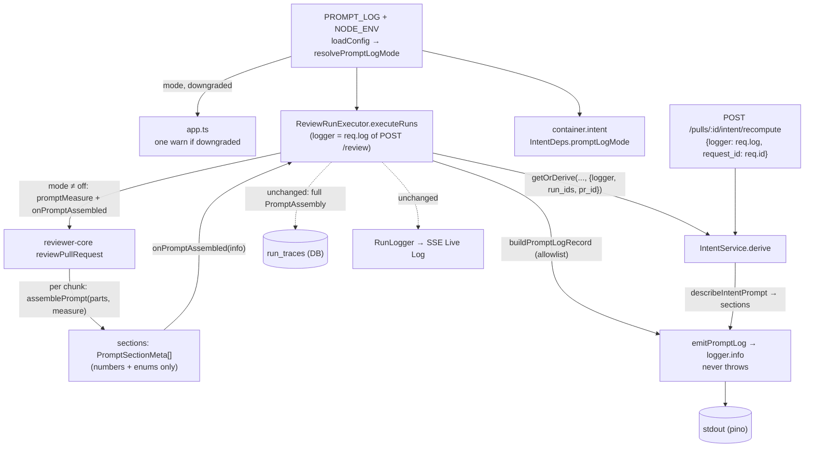

# Prompt Assembly Logging — Development Plan

Date: 2026-09-26 · Branch: feature/l03-intent-layer · Status: approved (open questions resolved, see the end)

> Execution note: the main session implements this plan inline. No subagents
> unless a task turns out to need one.

## Goal
Every prompt the server sends to a model (each reviewer chunk, each intent
classification) produces one structured, **content-free** log record,
`event: "prompt.assembled"`. The record lists each prompt section's name, its
trust source, its size in chars and tokens, the chosen provider/model and the
correlation ids. It never contains a secret, a diff line, a spec or skill body,
or any other prompt text. `PROMPT_LOG=off|summary|verbose` controls it, and
`verbose` (a per-item breakdown plus 8-hex fingerprints) works only when
`NODE_ENV=development`.

## Context
- Request: safe structured logging of prompt assembly (section name, source, length in chars and/or tokens, chosen model, correlation ID). Never log secrets, the full diff or private spec content. Add a local-only verbose mode.
- **Precondition (satisfied):** this plan builds on the intent-layer work
  (`docs/plans/2026-09-25-intent-layer.md`). At execution time the working tree
  is clean apart from this plan file, and the intent-layer commits are on the
  branch (`414f1d8`, `56ad299`, `4e387f1`), so "one commit per task, explicit
  paths" does not mix two features.
- INSIGHTS entries that apply:
  - server · 2026-09-26 "A new enrichment step in `executeRuns` silently makes REAL network and LLM calls in `reviews.it.test.ts`". The new it case goes through `appWith`, which already mocks `github`, `webFetch`, `llm.openrouter` and the reviewer LLM. It must add no container-resolved client that `appWith` does not override (T002).
  - server · 2026-09-19 "`waitForPrRuns` returns on TIMEOUT". Assert terminal statuses before asserting on the log spy (T002).
  - server · 2026-09-22 "testcontainers Reaper / CONNECT_TIMEOUT flaky". Use `TESTCONTAINERS_RYUK_DISABLED=true` and retry on transient errors (T002).
  - server · 2026-09-22 "A NEW module that needs another module's SERVICE trips `no-circular`". The record builder lives in `platform/prompt-log.ts` and imports neither `container.ts` nor any module. `IntentService` keeps its structural `IntentDeps` (T001).
  - server · 2026-09-21 "Half the modules do NOT follow the documented anatomy". The intent route stays thin: it builds a correlation object and makes one service call (T001).
  - root · "pnpm 12.4.2 rejects `-s`". Always use `pnpm run <script>` (all tasks).
  - root · "server typecheck fails inside `../reviewer-core` when reviewer-core has no node_modules". Run `npm install` in `reviewer-core/` before trusting a server typecheck (T001, T002).
  - root · "`diff -r` over the two `vendor/shared` copies is NOT a drift gate". Not triggered, because no contract file changes (see Contracts).
- Spec invariants that apply:
  - `reviewer-core/specs/review-contract.md` › "Every optional slot is omit-when-empty": the prompt bytes stay identical. The new metadata is additive output, and an unused slot produces **no** section entry.
  - `reviewer-core/specs/review-contract.md` › Purity rules: no `process.env`, fs or network. Token counting and fingerprinting are **injected** functions, the same pattern as `llm`.
  - `reviewer-core/CLAUDE.md`: `INJECTION_GUARD` is a contract and stays unchanged. The server consumes the TS source through the path alias.
  - `server/specs/review-flow.md` › "What one run does" step 1: enrichment is best-effort and never fails a run. **Logging is held to the same rule:** a throwing logger or builder must never fail a run (T001).
  - `server/CLAUDE.md` › "Secrets are deliberately not part of `AppConfig`". `PROMPT_LOG` is a mode, not a secret, so it belongs in `AppConfig`. No secret is read by this feature.
- Closest existing features followed:
  - `ReviewInput.onEvent` / `checkCancelled` (`reviewer-core/src/review/run.ts:91,97`): an optional, injected callback the engine calls and the server implements.
  - `REPO_INTEL_ENABLED` / `EMBEDDINGS_ENABLED` in `server/src/platform/config.ts`: an env flag parsed by zod into a typed `AppConfig` field.
  - The content-free `"Intent derived"` record in `server/src/modules/intent/service.ts:375-388`.

## Scope
- In:
  - reviewer-core: `assemblePrompt` also returns `sections: PromptSectionMeta[]`. An optional injected `PromptMeasure` (`tokens`, `fingerprint`) is accepted. A new optional `ReviewInput.onPromptAssembled` callback fires once per prompt **actually sent** (each chunk), and `ReviewInput.promptMeasure` is threaded to it.
  - server: `platform/prompt-log.ts` (new), holding the mode resolver, the measure factory, the allowlist record builder and a never-throwing emitter. It adds `PROMPT_LOG` to config, a single downgrade warning at boot, executor wiring (reviewer prompts) and intent-classifier wiring (executor path and recompute route).
  - Tests: engine metadata plus byte-identity; a server canary (summary and verbose); verbose gating; one integration assertion on the executor path.
  - Docs: `server/.env.example`, `server/README.md` (Environment table), `reviewer-core/specs/review-contract.md`, `server/specs/review-flow.md` (one observability line).
- Out:
  - **The run trace in the DB keeps persisting the full `PromptAssembly`** (system, specs, user text) in `run_traces.prompt_assembly`, exactly as today (`run-executor.ts:340-344`). This feature changes stdout logging only. Recorded as an open question, not a task.
  - The SSE Live Log and `RunLogger` are unchanged. The new record goes **only** to the pino logger, never to `runLog` (which publishes `data` to the browser over SSE, `run-logger.ts:50-53`).
  - Any `vendor/shared` contract change (both copies untouched, see Contracts).
  - Pre-existing log lines that are not prompt-assembly records. For example, `RunLogger` mirrors `map: reviewing <path>` at debug level. They are neither audited nor changed here.
  - The CI runner (L06). It gets `onPromptAssembled` for free but wires nothing now.

## Design

**Rings (onion-architecture §2–§5):**

| Piece | Path | Ring | Why |
|---|---|---|---|
| `PromptSectionMeta`, `PromptMeasure`, `sections` output, `onPromptAssembled` | `reviewer-core/src/prompt.ts`, `reviewer-core/src/review/run.ts`, `reviewer-core/src/index.ts` | domain (pure engine) | Only the engine knows where section boundaries are. Measurement is injected, so the engine does no I/O and reads no env (review-contract Purity rules). |
| Mode resolver, measure factory (tiktoken + sha256), allowlist record builder, safe emitter | `server/src/platform/prompt-log.ts` (new) | cross-cutting platform helper (same tier as `platform/resilience.ts`, `platform/run-logger.ts`) | Two modules (`reviews`, `intent`) need it, and a module may not import another module (`no-cross-module-imports`). It is pure apart from `node:crypto`'s hash and imports no fastify, drizzle, container or module. |
| `PROMPT_LOG` → `AppConfig.promptLog`, `promptLogDowngraded` | `server/src/platform/config.ts` | composition root (onion §4: "Env / config") | The single place env is read. |
| Downgrade warning | `server/src/app.ts` | composition root | The logger exists only after `Fastify({ logger })`, and `loadConfig` has no logger. The warning is logged once per `buildApp`. |
| Reviewer record emission | `server/src/modules/reviews/run-executor.ts` | application | The executor already owns observability (`logger`, `runLog`) and holds every correlation field. |
| Intent section metadata | `server/src/modules/intent/prompt.ts` | domain | Next to `buildIntentMessages`, sharing its block rendering, so the measured sizes match the sent bytes. |
| Intent record emission | `server/src/modules/intent/service.ts` | application | `derive` is the one place the classifier prompt is built and sent. |
| `promptLogMode` in `IntentDeps` | `server/src/platform/container.ts` | composition root | The container already builds `IntentService` from config and ports. |
| Recompute correlation | `server/src/modules/intent/routes.ts` | presentation | Passes `req.log` plus `{ request_id: req.id, pr_id }`. It stays one service call. |

### Record shape (the allowlist)

`buildPromptLogRecord(input, mode)` returns a **new object built field by field**
(no spread of any input object). Every string field is either a closed enum or is
validated:

```ts
type PromptLogRecord = {
  event: 'prompt.assembled';
  v: 1;
  component: 'reviewer' | 'intent_classifier';
  log_mode: 'summary' | 'verbose';
  provider: string;              // Provider enum value, or 'unknown'
  model: string;                 // capped at 100 chars, [\w./:@-] only, else 'unknown'
  correlation: {
    pr_id: string;               // uuid-shaped, else dropped
    round_id?: string;           // uuid-shaped, else dropped; the `review_rounds` id of one review click (`service.ts` createRound)
    run_id?: string;             // reviewer: the agent run
    run_ids?: string[];          // intent inside executeRuns: shared pre-work fans out over every queued run
    request_id?: string;         // recompute route: req.id
    agent?: string;              // agent name, capped at 64 chars
  };
  review_mode?: 'single-pass' | 'map-reduce';
  chunk?: { index: number; count: number };   // index/count only, never the file path
  sections: {
    name: PromptSectionLogName;  // allowlist below; anything else becomes 'other'
    role: 'system' | 'user';
    source: 'trusted' | 'untrusted';
    chars: number;
    tokens?: number;
    items: number;
    fp?: string;                 // verbose only; must match /^[0-9a-f]{8}$/, else dropped
    item_detail?: { chars: number; tokens?: number; fp?: string }[]; // verbose only
  }[];
  totals: { chars: number; tokens?: number };
};
```

- Section-name allowlist: reviewer `system | task | pr_description | pr_intent | skills | memory | repo_map | specs | callers | diff`. Intent classifier `system | task | pr_title | description | issue | repo_doc | web | diff_outline`. Unknown names become `other`, so a future section name, or an intent **label**, can never carry text into a log.
- `summary` drops `fp` and `item_detail` even if the input carries them (defence in depth). `verbose` keeps them.
- The emitter is `emitPromptLog(logger, record)`. It calls `logger.info(record, 'prompt assembled')` inside `try/catch` and swallows the error, so logging never fails a run or a route.

### Section metadata (reviewer-core)

```ts
export type PromptSectionName =
  'system' | 'task' | 'pr_description' | 'pr_intent' | 'skills' | 'memory' |
  'repo_map' | 'specs' | 'callers' | 'diff';
export interface PromptMeasure {
  tokens?: (text: string) => number;
  fingerprint?: (text: string) => string;
}
export interface PromptSectionMeta {
  name: PromptSectionName;
  role: 'system' | 'user';
  source: 'trusted' | 'untrusted';
  chars: number;          // rendered length: heading + untrusted wrapper included
  items: number;          // skills/memory/specs: entry count; otherwise 1
  tokens?: number;        // only when measure.tokens is given
  fingerprint?: string;   // only when measure.fingerprint is given
  itemDetail?: { chars: number; tokens?: number; fingerprint?: string }[]; // list sections, only when measure.fingerprint is given
}
// assemblePrompt(parts, measure?) → { messages, assembly, sections }
// ReviewInput.promptMeasure?: PromptMeasure
// ReviewInput.onPromptAssembled?: (info: { mode: ReviewMode; chunkIndex: number; chunkCount: number; sections: PromptSectionMeta[] }) => void
```

- **Invariant (testable):** `sections.find(system).chars === messages[0].content.length`, and the sum of user-section `chars` plus `2 × (userSections − 1)` (the `'\n\n'` joins) equals `messages[1].content.length`.
- `source` follows what the rendered bytes contain:
  - trusted: `system` (agent prompt + guard), `skills`, `memory` (per `PromptParts` docs);
  - untrusted: everything else.
- **Change from the proposed design:** `task` is `untrusted`, not trusted. `taskLine` (`server/src/modules/reviews/helpers.ts:82-84`) embeds the PR title and author, which are author-controlled.
- `pr_intent` is `untrusted` even though it opens with the trusted scope rule, because its payload comes from author text.
- `onPromptAssembled` fires **only** for the per-chunk `assemblePrompt` at `run.ts:178`, never for the trace-only whole-diff assembly at `run.ts:148`. That call also gets **no** measure, so a single-pass review tokenises its diff once, not twice.
- With no `measure` and no callback, the engine behaves exactly as today.

### Modes and gating

| `PROMPT_LOG` | Effective when `NODE_ENV=development` | Otherwise | Record content |
|---|---|---|---|
| unset / `''` | `summary` | `summary` | per-section name/role/source/chars/tokens/items, totals, provider/model, correlation |
| `off` | `off` | `off` | nothing emitted; no measure, no callback passed to the engine |
| `summary` | `summary` | `summary` | as above |
| `verbose` | `verbose` | **`summary`** plus `promptLogDowngraded: true`, which gives one `warn` in `app.ts` | summary plus `fp` per section and `item_detail` (chars, tokens, fp) per skill/spec/memory entry |
| anything else | boot fails (zod enum) | boot fails | — |

- `resolvePromptLogMode(requested, nodeEnv) → { mode, downgraded }` is pure and lives in `prompt-log.ts`. `loadConfig` calls it.
- `createPromptMeasure(mode, tokenizer)` returns:
  - `off` → `undefined`;
  - `summary` → `{ tokens }`;
  - `verbose` → `{ tokens, fingerprint: sha256(text).hex.slice(0, 8) }`.
- Note: `NODE_ENV` **defaults to `development`** when unset (`config.ts:36`). See Open questions.

### Correlation

- **Reviewer record:** `round_id`, `run_id`, `pr_id`, `agent`, `review_mode`, `chunk`.
- **Intent record inside `executeRuns`:** `round_id`, `run_ids` (the fanned-out runs) and `pr_id`.
- **Intent record from `POST /pulls/:id/intent/recompute`:** `request_id: req.id` and `pr_id` (no round: recompute is not part of a review click).
- `round_id` is the existing DB round (`service.ts` `createRound`, stored on `agent_runs.round_id`). `ReviewService.runReview` already holds it and passes it as a new optional trailing parameter of `executeRuns` (`roundId?: string | null`; the only caller is `service.ts:140`). It groups every record of one review click by an id that also exists in the DB, so it survives log pipelines that drop pino's `reqId`. Pino's `reqId` binding from `req.log` (`reviews/routes.ts:41` → `service.ts:140`) still comes on top of it.



### Contracts
None. `PromptAssembly` (`server/src/vendor/shared/contracts/trace.ts:47`) and
every other `vendor/shared` file are unchanged in **both**
`server/src/vendor/shared/` and `client/src/vendor/shared/`. The new types are
engine-local (`reviewer-core/src/prompt.ts`, exported from
`reviewer-core/src/index.ts`) and server-local (`server/src/platform/prompt-log.ts`).
The client never sees them: the record goes to stdout only.

### Database
None.

## Global constraints
- Zod 3 only: no `zod/v4`, `zod/mini` or `z.toJSONSchema`. No do-not-touch paths. No migration.
- Tests follow `TESTING.md`: typological, hermetic, mocks from `server/src/adapters/mocks.ts`. DB-backed tests are `*.it.test.ts`.
- **Content-free by construction:** the record builder never spreads an input object, and no field of `PromptLogRecord` can hold free text (enums, validated ids, numbers, and 8-hex fingerprints in verbose only). No `PromptSectionMeta`, `PromptLogRecord` or callback payload ever carries prompt text.
- The prompt record never goes through `RunLogger` (SSE) and never into `run_traces`.
- Logging never fails a run or a request (`emitPromptLog` swallows errors). `PROMPT_LOG=off` gives byte-identical engine behaviour and zero tokenizer calls.
- `INJECTION_GUARD` and every rendered prompt byte are unchanged.
- `cd server && pnpm run arch:check` stays green and the baseline never grows.
- Execution: **sequential** waves only. T002 runs mutation probes on production files, and parallel tasks sharing the tree would see the mutated file. So no task runs in parallel with T002.

## Tasks

### Wave 0 — implementation (one implementer, sequential inside the task)

#### T001 — Section metadata in the engine + server prompt-log record, config gate and wiring
- Area: backend (reviewer-core + server)
- Agent: implementer
- Model: **opus**. The redaction allowlist and the verbose gate are security-sensitive, and the prompt must stay byte-identical.
- Depends on: intent-layer plan committed (see Context › Precondition)
- Files (exclusive):
  - `reviewer-core/src/prompt.ts` (modified)
  - `reviewer-core/src/review/run.ts` (modified)
  - `reviewer-core/src/index.ts` (modified: export `PromptSectionMeta`, `PromptSectionName`, `PromptMeasure`, `PromptAssembledInfo`)
  - `server/src/platform/prompt-log.ts` (new)
  - `server/src/platform/config.ts` (modified)
  - `server/src/app.ts` (modified: one downgrade `warn` after the Fastify instance exists)
  - `server/src/platform/container.ts` (modified: `promptLogMode: this.config.promptLog` in the `IntentService` deps)
  - `server/src/modules/reviews/run-executor.ts` (modified)
  - `server/src/modules/reviews/service.ts` (modified: pass `roundId` as the last argument of `executeRuns`)
  - `server/src/modules/intent/prompt.ts` (modified: `describeIntentPrompt`)
  - `server/src/modules/intent/service.ts` (modified)
  - `server/src/modules/intent/routes.ts` (modified)
- Skills:
  - `onion-architecture` → §2 (incl. the reviewer-core note), §3, §5 Application + Domain, §11;
  - `security` → A09 Logging, Secret Detection, A10 (fail-closed gate);
  - `fastify-best-practices` → rules/logging.md, rules/routes.md;
  - `zod` → schema-use-enums, compose-preprocess (Zod 3 caveat);
  - `typescript-expert` → Code Review Checklist (type safety only);
  - `reviewer-core/CLAUDE.md`, `reviewer-core/specs/review-contract.md`.
- Steps:
  1. **reviewer-core `prompt.ts`:**
     - Add the types from Design › Section metadata.
     - `assemblePrompt(parts, measure?)` builds `sections` alongside the existing `userSections` pushes, one meta entry per pushed string, in the same order.
     - Measure the **rendered** string: heading plus wrapper for `chars`, `measure.tokens?.(rendered)` and `measure.fingerprint?.(rendered)`.
     - For `skills`/`memory`/`specs`, fill `items` with the entry count, and `itemDetail` (raw entry chars/tokens/fingerprint) only when `measure.fingerprint` is given.
     - Do not change a single rendered byte. `assembly` is unchanged.
  2. **reviewer-core `run.ts`:**
     - Add `ReviewInput.promptMeasure?` and `ReviewInput.onPromptAssembled?` (JSDoc: content-free by type, fired once per chunk actually sent).
     - At the per-chunk call (`run.ts:178`), pass `input.promptMeasure` and then call `input.onPromptAssembled?.({ mode, chunkIndex, chunkCount: chunks.length, sections: a.sections })` **before** `completeStructured`, so a failed call is still logged.
     - The trace-only assembly at `run.ts:148` gets neither.
  3. **`platform/prompt-log.ts`:**
     - `PromptLogMode`, `resolvePromptLogMode(requested, nodeEnv)`, `createPromptMeasure(mode, tokenizer)` (`node:crypto` `createHash('sha256')`);
     - `PROMPT_SECTION_LOG_NAMES`, `buildPromptLogRecord(input, mode)` per Design › Record shape (field by field, allowlist names, validated ids, `fp` regex, summary drops `fp`/`item_detail`, `totals` summed from the sections);
     - `emitPromptLog(logger, record)` (try/catch).
     - Imports: `@devdigest/reviewer-core` **types only**, `node:crypto`, and the structural `Tokenizer` shape `{ count(text): number }` declared locally. No adapter import, no fastify, no container.
  4. **`config.ts`:**
     - `PROMPT_LOG: z.preprocess((v) => (v === '' ? undefined : v), z.enum(['off','summary','verbose']).optional())`.
     - `AppConfig.promptLog: PromptLogMode` and `AppConfig.promptLogDowngraded: boolean` via `resolvePromptLogMode(parsed.PROMPT_LOG ?? 'summary', parsed.NODE_ENV)`, each with JSDoc.
  5. **`app.ts`:** right after `Fastify(...)`, `if (config.promptLogDowngraded) app.log.warn({ requested: 'verbose', effective: 'summary', nodeEnv: config.nodeEnv }, 'PROMPT_LOG=verbose is honoured only when NODE_ENV=development; using summary')`.
  6. **`run-executor.ts`:**
     - Once per `executeRuns`, `const promptLogMode = this.container.config.promptLog` and `const measure = createPromptMeasure(promptLogMode, this.container.tokenizer)`.
     - In `runOneAgent`, when the mode is not `off` and `logger` is set, pass `promptMeasure: measure` and `onPromptAssembled: (info) => emitPromptLog(logger, buildPromptLogRecord({ component: 'reviewer', provider: agent.provider, model: agent.model, correlation: { run_id: runId, pr_id: pull.id, agent: agent.name }, review_mode: info.mode, chunk: { index: info.chunkIndex, count: info.chunkCount }, sections: info.sections }, promptLogMode))`.
     - `runOneAgent` needs `logger` and `roundId`, so thread them as new parameters. It currently receives only `runLog`. `executeRuns` gets a new optional trailing `roundId?: string | null`, and `service.ts` passes its `roundId`. Add `round_id: roundId ?? undefined` to the reviewer correlation above.
     - Pass `{ logger, correlation: { round_id: roundId ?? undefined, run_ids: jobs.map((j) => j.runId), pr_id: pull.id } }` as the new last argument of `getOrDerive`.
     - Never route the record through `runLog`.
  7. **`intent/prompt.ts`:** extract the block rendering `buildIntentMessages` uses into a private helper. Add `describeIntentPrompt(sections, title, measure?)`, which returns section metas named `system` / `task` / `pr_title` / `<kind>`, grouped by `IntentSourceKind` (items = sections of that kind), with `chars` equal to the rendered block length. `buildIntentMessages` output stays byte-identical.
  8. **`intent/service.ts`:**
     - `IntentDeps.promptLogMode: PromptLogMode`, plus an exported `IntentPromptLogContext = { logger: { info(obj: unknown, msg?: string): void }; correlation: { pr_id: string; run_ids?: string[]; request_id?: string } }`.
     - Optional last parameter `promptLog?: IntentPromptLogContext` on `getOrDerive`, `recompute` and `derive`.
     - In `derive`, after `resolveFeatureModel` and **before** `completeStructured`, emit `component: 'intent_classifier'` when the mode is not `off` and `promptLog` is given.
     - Remove `sectionChars` and `tokenEstimate` from the `"Intent derived"` record. Section sizes now live only in the `prompt.assembled` record, so there is one shape. Every other field of that record is unchanged.
  9. **`intent/routes.ts`:** recompute passes `{ logger: req.log, correlation: { request_id: req.id, pr_id: req.params.id } }`.
- Acceptance criteria:
  - `cd reviewer-core && npm test` is green with **no edit** to existing assertions. The existing byte-identity and omit-when-empty tests prove the prompt is unchanged.
  - `rg -n "process\.env|node:crypto|node:fs" reviewer-core/src` prints nothing new.
  - `rg -n "onPromptAssembled|promptMeasure" server/src` hits only `run-executor.ts`.
  - `rg -n "prompt.assembled|buildPromptLogRecord" server/src/modules` shows no `runLog.` call carrying the record.
  - `rg -n "\.\.\.(input|info|meta|s)\b" server/src/platform/prompt-log.ts` prints nothing (no spread in the builder).
  - `rg -n "sectionChars|tokenEstimate" server/src` prints nothing.
  - `cd server && pnpm exec tsx -e "import('./src/platform/config.ts').then(m=>{const c=m.loadConfig({...process.env,PROMPT_LOG:'verbose',NODE_ENV:'production'});console.log(c.promptLog,c.promptLogDowngraded)})"` prints `summary true`.
  - `arch:check` is green with an unchanged baseline.
- Verify:
  - `cd reviewer-core && npm install && npm run typecheck && npm test`
  - `cd server && pnpm run typecheck && pnpm run arch:check && pnpm exec vitest run --exclude '**/*.it.test.ts'`
  - `cd server && TESTCONTAINERS_RYUK_DISABLED=true pnpm exec vitest run test/reviews.it.test.ts test/intent.it.test.ts` (existing cases stay green; needs Docker)
- Constraints:
  - reviewer-core purity and omit-when-empty.
  - review-flow "enrichment never fails a run", applied to logging.
  - server INSIGHTS 2026-09-22 cycle rule: `prompt-log.ts` imports no module and no container.
  - The `IntentUseCases` doubles in `server/test/reviews.it.test.ts` keep compiling because the new parameter is optional and trailing.

### Wave 1 — tests (one test-writer, with real mutation probes)

#### T002 — Tests: engine metadata, content-free canary, verbose gate, executor integration
- Area: backend (reviewer-core + server)
- Agent: test-writer
- Model: **opus**. The canary and gating tests are the security proof, and the mutation probes must be chosen adversarially.
- Depends on: T001
- Files (exclusive):
  - `reviewer-core/test/prompt.test.ts` (modified: new cases only)
  - `reviewer-core/test/run.test.ts` (modified: new case only)
  - `server/test/prompt-log.test.ts` (new)
  - `server/test/reviews.it.test.ts` (modified: one new case only)
- Skills: `TESTING.md`; `onion-architecture` → §8; `security` → A09; `fastify-best-practices` → rules/testing.md; `typescript-expert` → Code Review Checklist (type safety only).
- Steps:
  1. **`prompt.test.ts`:**
     - With every slot filled, `sections.map(s => s.name)` equals `['system','task','pr_description','pr_intent','skills','memory','repo_map','specs','callers','diff']`, and `source` matches Design (`task` untrusted).
     - The chars invariant holds: system chars equal the system message length, and the user sections' chars plus the `'\n\n'` joins equal the user message length.
     - With only `diff`, no optional section appears.
     - `assemblePrompt(parts, { tokens: (t) => t.length, fingerprint: () => 'deadbeef' })` produces `messages` **deep-equal** to `assemblePrompt(parts)`, and `itemDetail.length === skills.length`.
  2. **`run.test.ts`:** a 2-file diff with `strategy: 'map-reduce'` calls `onPromptAssembled` exactly twice, with `chunkIndex` 0 and 1 and `chunkCount: 2`. Single-pass calls it once, not twice (the trace assembly is excluded).
  3. **`server/test/prompt-log.test.ts` (unit, hermetic):**
     - **Canary (summary and verbose):** build the parts from canary strings: a secret-like `sk-or-v1-CANARY0123456789abcdef`, a diff body line `+const CANARY_DIFF_LINE = 1;`, spec text `CANARY_SPEC_TEXT`, a skill body, a PR title and a description. Run the real `assemblePrompt` with `createPromptMeasure(mode, { count: (t) => t.length })`, then `buildPromptLogRecord` → `JSON.stringify`. Assert that no canary substring appears in either mode. Also feed an intent-style section with the name `issue-0 CANARY_LABEL` and assert it is emitted as `other` or `issue`, never with the label text.
     - **Summary strips verbose fields:** input metas that carry `fingerprint`/`itemDetail` produce no `fp`/`item_detail` in summary. A non-8-hex fingerprint is dropped in verbose.
     - **Gating:** `loadConfig({ PROMPT_LOG: 'verbose', NODE_ENV: 'development' })` → `verbose`, not downgraded. With `production` and with `test` → `summary`, downgraded. `PROMPT_LOG: ''` → `summary`. `PROMPT_LOG: 'loud'` throws. `createPromptMeasure('off', …)` is `undefined`.
     - **Never throws:** `emitPromptLog` with a logger whose `info` throws returns normally.
  4. **`reviews.it.test.ts`, one new case:**
     - Build the app through the existing `appWith(REVIEW_FIXTURE)` (hermetic overrides already present) and create an agent and PR the same way as the neighbouring cases.
     - Then `const svc = new ReviewService(app.container)`, `const targets = await svc.resolveTargets(workspaceId, { agentId })`, and `const { runs } = await svc.runReview(workspaceId, pr.id, targets, spyLogger)`. `spyLogger` is a plain object recording `info` calls; the other methods are no-ops.
     - `waitForPrRuns`, then assert every status is terminal and `done`.
     - Assert that exactly one recorded `info` object has `event: 'prompt.assembled'`, `component: 'reviewer'`, `correlation.run_id === runs[0].run_id` and `model: 'gpt-4.1'`. Assert that one has `component: 'intent_classifier'` with `correlation.run_ids` containing that run id. Assert both carry the same uuid-shaped `correlation.round_id`, equal to `agent_runs.round_id` of that run (read it from the DB). Assert that `JSON.stringify` of every recorded prompt record contains neither a line of `DIFF` nor the seeded PR body.
  5. **Mutation probes (executed, one line each, `shasum` before and after, reverted in the same step):**
     - (a) in `buildPromptLogRecord`, add `text`/a spread of the input section → the canary fails;
     - (b) in `resolvePromptLogMode`, drop the `nodeEnv` check → gating fails;
     - (c) in `run.ts`, move the callback to the `run.ts:148` assembly → the map-reduce count fails;
     - (d) in `prompt.ts`, change a `chars` computation to omit the heading → the chars invariant fails.
     No other task runs during W1, so every probe is permitted.
- Acceptance criteria:
  - Each new test fails under at least one listed probe, and the report shows the command output.
  - One happy path plus the edge that matters per behaviour. No test asserts a mock was called as a substitute for behaviour; the recorded log object **is** the observable output.
- Verify:
  - `cd reviewer-core && npm run typecheck && npm test`
  - `cd server && pnpm run typecheck && pnpm exec vitest run test/prompt-log.test.ts && pnpm run arch:check`
  - `cd server && TESTCONTAINERS_RYUK_DISABLED=true pnpm exec vitest run test/reviews.it.test.ts`
- Constraints:
  - server INSIGHTS 2026-09-26: `appWith` hermetic overrides, and adding no unmocked client;
  - `waitForPrRuns` returns on timeout, so assert terminal statuses first;
  - testcontainers flakiness: retry on `CONNECT_TIMEOUT`.
  - The config test passes `env` explicitly to `loadConfig`, never mutating `process.env`.

### Wave 2 — review gates (no task; main session)
Run `architecture-reviewer` (scope: base `main`) and `plan-verifier` (this plan)
in **one message** (both read-only, so parallel is safe). CRITICAL/MAJOR findings
and `PARTIAL`/`NOT MET` items become fix tasks for an `implementer` (model:
opus if they concern redaction or gating, otherwise sonnet). Re-run both until
`PASS` and `VERIFIED`.

### Wave 3 — docs (after the gates pass)

#### T003 — Document `PROMPT_LOG` and the engine's section metadata
- Area: docs (server + reviewer-core)
- Agent: doc-writer
- Model: **sonnet** (mechanical).
- Depends on: T001, T002, Wave 2 gates
- Files (exclusive):
  - `server/.env.example` (modified: `PROMPT_LOG=` with a comment listing `off | summary | verbose`, default summary, verbose only when `NODE_ENV=development`)
  - `server/README.md` (modified: one row in the **Environment** table)
  - `reviewer-core/specs/review-contract.md` (modified: `promptMeasure` and `onPromptAssembled` rows in the Input table; `sections` in Output with the chars invariant; a Purity note that measurement is injected)
  - `server/specs/review-flow.md` (modified: one observability invariant: a content-free `prompt.assembled` record per prompt sent, stdout only, never fails a run; the run trace still stores the full assembly)
- Skills: root CLAUDE.md › Language (English only).
- Acceptance criteria:
  - Every statement matches the shipped code (field names, modes, the downgrade rule).
  - Nothing duplicates an INSIGHTS entry.
- Verify: `rg -n "PROMPT_LOG|onPromptAssembled|prompt.assembled" server/.env.example server/README.md reviewer-core/specs/review-contract.md server/specs/review-flow.md`

After T003, the main session runs `pnpm run typecheck && pnpm test` in `server/`,
plus `npm run typecheck && npm test` in `reviewer-core/`. It then captures insights
through `engineering-insights` and asks the user to run `/pr-self-review`.

## Ownership check
| File | Task |
|---|---|
| `reviewer-core/src/{prompt,index}.ts`, `reviewer-core/src/review/run.ts` | T001 |
| `server/src/platform/{prompt-log,config,container}.ts`, `server/src/app.ts` | T001 |
| `server/src/modules/reviews/{run-executor,service}.ts` | T001 |
| `server/src/modules/intent/{prompt,service,routes}.ts` | T001 |
| `reviewer-core/test/{prompt,run}.test.ts` | T002 |
| `server/test/prompt-log.test.ts`, `server/test/reviews.it.test.ts` | T002 |
| `server/.env.example`, `server/README.md`, `reviewer-core/specs/review-contract.md`, `server/specs/review-flow.md` | T003 |

Every wave has exactly one task, so no file is shared within a wave. There is no
lockfile, `package.json`, schema, migration, `client/messages/*.json` or
coupled-files pair in this plan. `vendor/shared` is untouched in both copies.

## Risks
- **Content leaks through a future field:**
  - Controls: the builder is field-by-field with an allowlist, unknown section names become `other`, and the `fp` regex rejects anything but 8 hex.
  - Proof: the canary test runs in both modes, and mutation probe (a) shows the canary catches a spread (T001, T002).
- **Low-entropy items can be brute-forced from a 32-bit fingerprint** (e.g. a one-line memory item). Fingerprints are verbose-only, and verbose is development-only. Documented in T003 (Open questions).
- **Tokenizer cost:** tiktoken over each chunk's diff per agent, which is roughly the size of the prompt. The LLM call dwarfs it. `PROMPT_LOG=off` removes it entirely, and the trace-only assembly is never measured (T001 step 2).
- **A throwing logger or builder failing a review:** `emitPromptLog` swallows errors, and T002 tests it.
- **Verbose accidentally on in production:** gated on `NODE_ENV=development` with one boot warning. But `NODE_ENV` defaults to `development` when unset (Open questions). Even then, verbose output holds sizes and hashes, never content.
- **Mixing intent-layer and logging edits in one commit:** the precondition in Context requires the intent-layer commits first.
- **Byte drift in the prompt:** covered by the unchanged existing reviewer-core tests plus the deep-equal-with-measure test (T002 step 1).

## Decisions (former open questions, resolved by the user on 2026-09-26)
- **Correlation id:** add an explicit `round_id` (the existing DB round), on top of `run_id` / `run_ids` / `request_id` and pino's `reqId`. Folded into Design › Correlation and T001.
- **Intent classifier:** included, same record shape (`component: 'intent_classifier'`).
- **"Local only":** keep `NODE_ENV=development` as the only gate. Known consequence: `NODE_ENV` defaults to `development` when unset, so a deploy that forgets it honours verbose. Accepted, since verbose holds sizes and 8-hex hashes, never content.
- **Run trace:** left as is. `run_traces.prompt_assembly` keeps the full `PromptAssembly` and `GET /runs/:id/trace` serves it. Not part of this feature.
