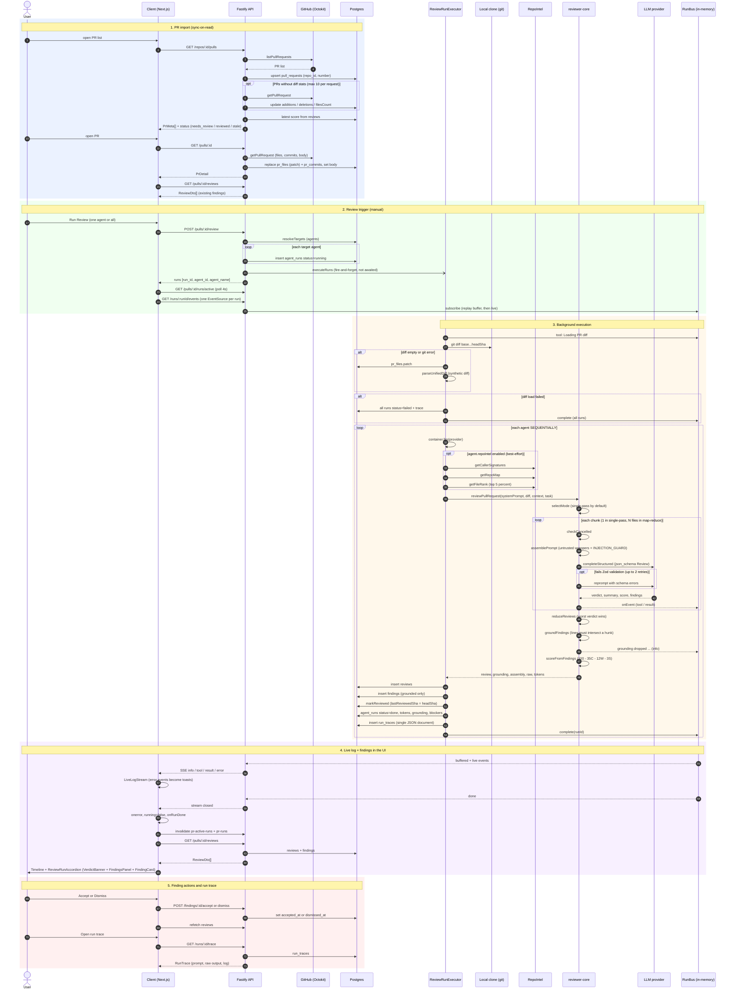

# Review flow: from PR import to findings in the UI

End-to-end sequence of how a pull request gets into DevDigest, how a review
runs, and how its findings reach the PR detail page.

## Not shown in the diagram

- **Cancel.** `POST /runs/:id/cancel` calls `runBus.cancel`. The engine stops
  at its next `checkCancelled` checkpoint, before the next LLM call. The server
  also marks the row `cancelled` and completes the bus immediately, so orphaned
  runs can be cancelled too.
- **Per-agent failure.** Status `failed`, the error text and the log so far
  are persisted. The remaining agents keep running.
- **Server restart.** `RunBus` is in-memory and reviews don't go through
  `JobRunner`, so runs still `running` at boot are reaped by `reapStaleRuns`.

## Things that aren't obvious

- **The fallback diff depends on the PR page having been opened.** `pr_files`
  is only filled by `GET /pulls/:id`. With no local clone and no prior detail
  fetch, the diff is empty. GitHub also truncates `patch` for large files.
- **`markReviewed` uses the `headSha` from when the run started.** A push
  during the review correctly leaves the PR as `needs_review`.
- **Findings dropped by grounding are not stored.** They only appear in the
  run trace log.
- **The score is deterministic.** It is computed from the grounded findings,
  and the model's own `score` is ignored. The verdict still comes from the model.
- **`{all:true}` runs agents one after another.** Total time is the sum of the
  per-agent times.

## Key files

| Stage | File |
| --- | --- |
| PR import | `server/src/modules/pulls/routes.ts`, `server/src/modules/polling/routes.ts` |
| Review status | `server/src/modules/pulls/status.ts` |
| Trigger | `server/src/modules/reviews/routes.ts`, `server/src/modules/reviews/service.ts` |
| Execution | `server/src/modules/reviews/run-executor.ts`, `server/src/modules/reviews/diff-loader.ts` |
| Engine | `reviewer-core/src/review/run.ts`, `reviewer-core/src/prompt.ts`, `reviewer-core/src/grounding.ts`, `reviewer-core/src/review/reduce.ts` |
| Live events | `server/src/platform/sse.ts` |
| Client | `client/src/lib/hooks/reviews.ts`, `client/src/app/repos/[repoId]/pulls/[number]/page.tsx` and its `_components/` |
