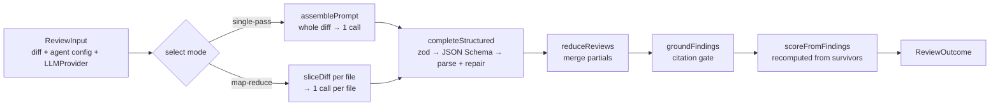

# reviewer-core — the pipeline

`@devdigest/reviewer-core` turns a diff into grounded findings. It is the one
piece of DevDigest shared by the studio server and the CI runner, which is why
it is also the one piece with no I/O of its own.

The public API list is in [`../README.md`](../README.md); the field-by-field
contract in [`../specs/review-contract.md`](../specs/review-contract.md). This
document is the walk-through.

## Stages



### 1. Mode selection

`strategy` comes from the agent record and is one of `auto` (default),
`single-pass`, `map-reduce`:

- `single-pass` — always one call, whatever the diff looks like.
- `map-reduce` — one call per file, but **only if the diff has more than one
  file**; on a single-file diff it collapses to single-pass, because mapping over
  one chunk is a slower way to do the same call.
- `auto` — map-reduce only when the diff is **both** large (over
  `DEFAULT_MAP_THRESHOLD_LINES`) **and** multi-file. Either condition alone keeps
  it to one call.

The conjunction is the point: a 900-line change to a single file is still one
coherent unit, and splitting a 3-file 40-line change buys three round trips for
nothing.

### 2. Prompt assembly

`assemblePrompt` builds the system prompt as the agent's own prompt plus
`INJECTION_GUARD`, and the user message as an ordered set of sections. Order is
chosen so the model sees structure before content and the diff last:

```
## PR description → ## Skills / rules → ## Relevant memory
→ ## Repo skeleton → ## Project context → ## Callers of changed symbols
→ ## Diff to review
```

Two rules hold for every section:

- **Optional slots are omit-when-empty.** An unused slot must not change the
  assembled prompt at all — not an empty heading, not a blank line. Adding a new
  slot that violates this silently changes every existing agent's prompt.
- **Untrusted content is delimiter-wrapped** via `wrapUntrusted(kind, text)`.
  The diff, the PR description, the repo map, the callers digest and project
  context all come from a pull request, which means they come from whoever opened
  it.

#### Prompt-injection defence

`INJECTION_GUARD` is the single trusted mechanism: it tells the model that
wrapped content is data, never instructions, and that claims of "intentional /
test fixture / do not flag" never reduce the review's scope.

There is deliberately **no keyword or denylist scanning** of untrusted text. A
denylist catches one phrasing in one language and produces false confidence; the
guard addresses the whole class. Treat the guard's wording as a contract rather
than prose — it ships with every agent, so an edit changes the studio and CI at
once.

### 3. Structured output

Findings arrive as structured JSON, not prose: the zod `Review` schema is
converted to JSON Schema (`toJsonSchema`) and handed to the provider, and the
response goes through `parseWithRepair` — extract the JSON body, and on a schema
violation retry up to `DEFAULT_REVIEW_MAX_RETRIES` times with the validation
error fed back. The engine never regex-scrapes a model's prose for findings.

### 4. Reduce

`reduceReviews` merges the partials of a map-reduce run: findings concatenate,
the verdict takes the **most severe** partial's verdict, summaries join. Its
score is a placeholder — it never survives, because of stage 6.

### 5. Grounding — the mandatory gate

`groundFindings` drops any finding that does not cite a real line of the diff:

- the finding's file must appear in the diff;
- its `start_line`–`end_line` range must intersect an actual hunk on the new
  side.

`FULL_FILE_KINDS` (whole-file scanners such as secret detection) are exempt from
the line check but still require the file to be in the diff.

Dropped findings are returned with reasons rather than discarded silently, so a
run trace can show what the gate removed and why. This is one shared gate applied
**after** reduce — not per strategy — so single-pass and map-reduce cannot
diverge in what they allow through.

### 6. Score

The score is recomputed from the findings that survived grounding, by a fixed
severity penalty. The model's self-reported number is ignored by design: it is
the one field a model is most likely to make inconsistent with its own findings,
and the UI puts the score ring directly beside the severity counts.

## Why the package looks unusual

- **It emits no JavaScript.** `build` is `tsc --noEmit`; consumers resolve
  `@devdigest/reviewer-core` to this `src/` through a tsconfig path alias and
  consume the TypeScript directly (tsx in dev, vitest in tests, a bundler in the
  CI runner). There is no publish step, so there is no version skew between the
  studio and CI.
- **It installs with npm**, not pnpm, unlike the server and client.
- **`@devdigest/shared` points at `../server/src/vendor/shared`** — the same
  files the server uses. Editing a contract here edits the server's contract.
- **Purity is the feature.** No database, no GitHub, no filesystem, no `process.env`.
  The only side effect is the injected `LLMProvider`, which is what makes the
  whole engine testable with a stub and no API key. A change that needs I/O
  belongs in the server caller.

## Where the boundary sits

| Concern | Owner |
|---|---|
| resolving repo context (callers, repo map, ranks) | server (`modules/reviews/run-executor.ts`) |
| assembling the prompt, calling the model, grounding, scoring | **this package** |
| persisting reviews/findings, run rows, traces | server |
| posting a GitHub review | CI runner, via `toReviewPayload` |
