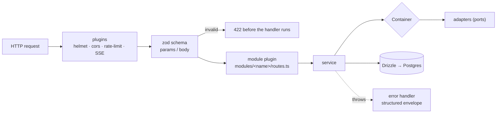

# server — architecture

How `@devdigest/api` is put together: what happens to a request, who constructs
what, and where the seams are. The API *map* (which route belongs to which
module) lives in [`../README.md`](../README.md) — this document is the layer
underneath it.

Read this before adding a module, touching the DI container, or changing the
error envelope. For the review cycle itself see
[`../specs/review-flow.md`](../specs/review-flow.md).

## Request lifecycle



Four things about this order are deliberate:

1. **Plugins register before modules.** Module plugins are encapsulated, so they
   inherit only what was registered before them — helmet, cors, rate-limit, SSE
   and the shared error handler. Registering a plugin after the module loop
   silently excludes every route.
2. **Validation is schema-first.** Routes declare zod `params` / `body` via
   `fastify-type-provider-zod`, and the same schema drives response
   serialization. One definition, both directions. A handler that calls
   `Schema.parse(req.body)` by hand is working around the mechanism, not with it.
3. **The body cap is explicit** (`bodyLimit`, 1 MB in `app.ts`). Every legitimate
   payload here — settings, a PR comment, an agent prompt — is far below it.
4. **Rate limiting is global with per-route overrides**, and disabled entirely
   under `NODE_ENV=test` so integration suites can hammer `app.inject()`. SSE and
   the health routes opt out via `config: { rateLimit: false }`.

### Health

- `GET /health` — liveness. No DB, no module, no rate limit.
- `GET /health/ready` — readiness. Issues `select 1`; a failure returns **503**,
  not 500, so an orchestrator reads "not ready yet" rather than "crashed".

### Error envelope

Every failure leaves as `{ error: { code, message, details? } }`. The handler in
`app.ts` branches in this order, and the order matters:

| Case | Status | Note |
|---|---|---|
| zod request-validation failure | 422 | raised by the type provider, before the handler |
| response serialization failure | 500 | the offending object is logged, never returned |
| `ZodError` (by `instanceof` **or by shape**) | 422 | service-level `.parse()` calls |
| `AppError` subclass | `err.statusCode` | `NotFoundError`, `ConfigError`, … |
| anything else | 500 | logged in full |

The shape check for `ZodError` exists because `instanceof` fails across duplicate
zod module instances (the vendored contracts and the API can resolve different
copies). Simplifying it to `instanceof` reintroduces 500s where a 422 belongs.

## Dependency injection

`platform/container.ts` is the composition root. One `Container` per app
instance, decorated onto Fastify as `app.container`.

- **Adapters are lazy.** `git`, `codeIndex`, `depgraph`, `tokenizer`, `priceBook`
  and the repositories are constructed on first access and memoised. Anything
  needing a secret (`github()`, `llm(id)`, `embedder()`) is `async`, because the
  key comes from `SecretsProvider` at call time rather than at boot.
- **Tests inject doubles** through `ContainerOverrides`, and an override always
  wins over construction. `src/adapters/mocks.ts` holds the standard doubles
  (`MockLLMProvider`, `MockGitClient`, …), so the unit lane needs no keys and no
  network. `new SomeAdapter()` inside a service defeats all of this.
- **Shared repositories live here**, not inside a feature module: `agentsRepo`,
  `reviewRepo` and the `repoIntel` facade are cross-cutting, so consumers reach
  them through the container instead of importing another module's folder.

### Ports

| Port | Default implementation | Notes |
|---|---|---|
| `SecretsProvider` | `adapters/secrets/local.ts` | the single read chokepoint for keys |
| `AuthProvider` | `adapters/auth/local.ts` | `LocalNoAuthProvider` → the seeded workspace |
| `GitHubClient` | `adapters/github/octokit.ts` | requires `GITHUB_TOKEN`, else `ConfigError` |
| `GitClient` | `adapters/git/simple-git.ts` | clones into `config.cloneDir`; `diff-parser.ts` beside it |
| `CodeIndex` | `adapters/codeindex/ripgrep.ts` | ripgrep search + `extract.ts` |
| `LLMProvider` | `adapters/llm/{openai,anthropic}.ts`, `OpenRouterProvider` from reviewer-core | cached per id |
| `Embedder` | `adapters/embedder/openai.ts` | gated by `EMBEDDINGS_ENABLED`; throws *before* constructing the client, so a disabled build makes zero OpenAI calls |
| `DepGraph` | `adapters/depgraph` (dependency-cruiser) | repo-intel indexing only |
| `Tokenizer` | `adapters/tokenizer` (js-tiktoken) | repo-map budget search |

### Secrets and config

`AppConfig` (`platform/config.ts`) deliberately carries **no** secrets. Keys are
read through `LocalSecretsProvider`, which merges a JSON file
(`~/.devdigest/secrets.json`, mode `0600`) over `process.env`, with the stored
value winning so a key typed into Settings beats a stale shell export.
`GITHUB_TOKEN` is canonical; `GITHUB_PAT` is accepted as a read-only fallback.

Swapping in a Vault-backed provider therefore touches one file and no call sites.

### Pricing

`container.priceBook` fetches live OpenRouter model prices and falls back to the
static `adapters/llm/pricing.ts` table for OpenAI/Anthropic and for a cold or
failed cache. With no OpenRouter key it degrades to `[]` rather than throwing —
cost attribution is best-effort, and a missing price must read as *unknown*
(`null`), never as free (`0`).

## Anatomy of a module

```
src/modules/<name>/
  routes.ts        # default-exported Fastify plugin — the only entry point
  service.ts       # orchestration; talks to the container, not to adapters directly
  repository.ts    # Drizzle queries for this module's tables
```

Register it with one import and one entry in `src/modules/index.ts`. Filesystem
autoload is deliberately unused: static registration is the only form that works
identically under `tsx`, a bundler, and vitest, since native `import()` of `.ts`
is not portable. `@fastify/autoload` sitting in `dependencies` is not a hint to
switch.

Cross-cutting helpers live in `modules/_shared/` — `getContext(container, req)`
resolves `{ workspaceId, userId }` through the `AuthProvider` so no module
re-derives tenancy, and `schemas.ts` holds `IdParams`.

## Data layer

`db/schema.ts` is a barrel over thirteen domain files in `db/schema/`:

| File | Tables |
|---|---|
| `core.ts` | `users`, `workspaces`, `workspace_members`, `settings` |
| `repos.ts` | `repos` |
| `pulls.ts` | `pull_requests`, `pr_files`, `pr_commits` |
| `reviews.ts` | `reviews`, `findings`, `pr_intent`, `pr_brief` |
| `runs.ts` | `agent_runs`, `run_traces`, `multi_agent_runs` |
| `agents.ts` | `agents`, `agent_versions`, `agent_skills` |
| `repo-intel.ts` | `repo_index_state`, `file_edges`, `file_facts`, `file_rank`, `repo_map_cache` |
| `context.ts` | `onboarding`, `code_chunks`, `symbols`, `references` |
| `knowledge.ts` | `conventions`, `memory` |
| `skills.ts` | `skills`, `skill_versions` |
| `eval.ts` | `eval_cases`, `eval_runs`, `conformance_checks`, `composed_reviews` |
| `ci.ts` | `ci_installations`, `ci_runs` |
| `ops.ts` | `installed_plugins`, `digests`, `jobs` |

The schema is **complete from day one**: most of these tables are empty and
belong to later lessons. They are not dead code to clean up.

Two rules hold across the schema, with one documented exception:

- Every domain table carries `workspace_id` and every query scopes by it, even
  though auth currently resolves to a single seeded workspace.
- **`findings` is the exception** — it has no `workspace_id` and no indexes.
  Tenancy reaches a finding only through its review, so any aggregate over
  findings must join `reviews` and scope on `reviews.workspace_id`. That join is
  the tenancy boundary, not an optimisation.

Migrations are generated with `pnpm db:generate` (drizzle-kit) and applied with
`pnpm db:migrate`. **They never run on boot** — a fresh database that was not
migrated fails at the first query, by design, rather than mutating itself under a
running server.

## Background work and observability

- **Run events** stream over SSE (`platform/sse.ts`, `runBus`). A run publishes
  `info` / `tool` / `result` / `error` events; the same bus answers
  `isCancelled(runId)`, which is how cancellation reaches a running review.
- **Run traces** are written once, at the end of a run, as a single JSON
  document in `run_traces` — not as a stream of rows. `platform/trace-builder.ts`
  and `run-logger.ts` assemble it.
- **Orphan reaping.** A previous process that died mid-run leaves `agent_runs`
  rows stuck in `running` with no runner to finish or cancel them. `app.ts`
  reaps them **before** the server accepts requests: a fresh process cannot have
  in-flight runs of its own yet, so every `running` row at that moment is
  genuinely orphaned. This assumes a single API instance per database; replicas
  would need per-instance scoping or heartbeats.

## repo-intel

The codebase indexer is a module, not a separate service:
[`../src/modules/repo-intel/README.md`](../src/modules/repo-intel/README.md) has
its pipeline diagram and the full facade. What matters at this level:

- Everything downstream reads through the `RepoIntel` facade
  (`container.repoIntel`), never through the pipeline internals.
- It is **read-only during a review** — indexing happens on clone and on fetch,
  so adding repo context to a prompt costs no analysis at request time.
- It is **best-effort**: an unindexed or partially indexed repo returns empty
  results instead of throwing, and the review degrades to diff-only. The degraded
  status and reason stay observable through `getIndexState()`.

## Testing seams

The container is the seam that makes the unit lane hermetic, and a real Postgres
is the seam integration tests refuse to fake. Full policy:
[`../../TESTING.md`](../../TESTING.md). The one rule that bites if forgotten: a
DB-backed test **must** be named `*.it.test.ts`, or the split stops covering it.
