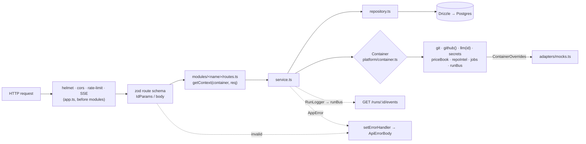

# Architecture of `@devdigest/api`

How the server package is put together and why. Paths are relative to
`server/src/` unless they start with `server/` or `reviewer-core/`. The
behavioural contract of a review run lives in
[`../specs/review-flow.md`](../specs/review-flow.md); this file is about the
plumbing around it.

## Boot sequence

`server.ts` is the only entrypoint (`pnpm dev` runs `tsx watch src/server.ts`).
Its `main()` calls `loadConfig()` (`platform/config.ts`, a zod `EnvSchema` over
`process.env` with secret keys deliberately absent), then `buildApp({ config })`,
installs `SIGTERM`/`SIGINT` handlers that call `app.close()` once (a `closing`
guard) and an `unhandledRejection` listener that logs and keeps the process
alive (`uncaughtException` is deliberately not swallowed), then
`app.listen({ port: config.apiPort, host: '0.0.0.0' })`.

`buildApp` is exported so tests can `app.inject()` without a port. Its steps:

| Step | Code in `app.ts` | Note |
|---|---|---|
| Config + DB | `opts.config ?? loadConfig()`, `opts.db ?? createDb(...)` | A handle created here is closed in `onClose`. |
| Fastify | `bodyLimit: 1_048_576`, pino logger | `pino-pretty` only in `development`; `logLevel 'silent'` turns logging off. |
| Zod provider | `setValidatorCompiler` / `setSerializerCompiler` | Routes opt in via `app.withTypeProvider<ZodTypeProvider>()`. |
| Container | `new Container(config, db, opts.overrides)`, `app.decorate('container', ...)` | `container.jobs.setLogger(app.log)` so failed jobs are logged. |
| Reaping | `new ReviewService(container).reapStaleRuns()` | `run.repo.ts` `reapStaleRunningRuns` sets every `running` `agent_runs` row to `failed`. Awaited before listening (the comment rejects an async reaper, which could reap a brand-new run) and assumes one API instance per DB. Failure is a warning. |
| Plugins | `helmet`, `cors` (`origin: [config.webOrigin]`), `FastifySSEPlugin`, `rateLimit` 120/min | Global rate limit skipped when `nodeEnv === 'test'`. |
| Health | `GET /health`, `GET /health/ready` (`select 1`, 503 when down) | Both `rateLimit: false`. |
| Error handler | `app.setErrorHandler(...)` | Registered before modules so encapsulated plugins inherit it. |
| Modules | `for (const plugin of Object.values(modules)) await app.register(plugin)` | Registry in `modules/index.ts`. |

### Error envelope

The handler builds `{ error: { code, message, details } }` (`ApiErrorBody` in
`vendor/shared/contracts/platform.ts`), checking in this order:

1. `hasZodFastifySchemaValidationErrors(err)` → 422 `validation_error`, `details = err.validation`.
2. `isResponseSerializationError(err)` → 500 `internal_error`, generic message; the raw object is only logged.
3. A `ZodError` by `instanceof` or by shape (`name === 'ZodError'` plus an `issues`/`errors` array, because shared and api may load separate zod copies) → 422.
4. `AppError` (`platform/errors.ts`, default 400; `NotFoundError` 404, `ValidationError` 422, `ExternalServiceError` 502, `ConfigError` 500) → `err.statusCode` with its `code`, `message`, `details`.
5. Anything else → logged, `statusCode ?? 500`, `internal_error`.

## Request and DI flow

## The `Container`

`platform/container.ts` is the composition root, one per app, attached as
`app.container`. The constructor builds four members eagerly: `secrets`
(`overrides.secrets ?? new LocalSecretsProvider(config.secretsPath)`), `auth`
(`overrides.auth ?? new LocalNoAuthProvider(db)`), `runBus` (the singleton from
`platform/sse.ts`) and `jobs` (`new JobRunner(db)`). The rest is lazy, and
each lazy member checks `overrides` first:

| Member | Built as | Override key |
|---|---|---|
| `git` | `SimpleGitClient(config.cloneDir)` | `git` |
| `codeIndex` | `RipgrepCodeIndex(this.git)` | `codeIndex` |
| `repoIntel` | `RepoIntelService(this)` | `repoIntel` |
| `depgraph` / `tokenizer` | `DepCruiseGraph()` / `TiktokenTokenizer()` | `depgraph` / `tokenizer` |
| `agentsRepo` / `reviewRepo` | `AgentsRepository(db)` / `ReviewRepository(db)` | none (shared across modules) |
| `priceBook` | `PriceBook(lister, estimateCost)` | none |
| `github()` | `OctokitGitHubClient(token)` from `secrets.get('GITHUB_TOKEN')`; no token → `ConfigError` | `github` |
| `llm(id)` | `buildLlm(id)`, cached per id in `llmCache` | `llm[id]` |
| `embedder()` | `OpenAIEmbedder(await this.llm('openai'))`; throws `ConfigError` before building anything when `embeddingsEnabled` is false | `embedder` |

`buildLlm` maps `'openai'` → `OpenAIProvider(OPENAI_API_KEY)`, `'anthropic'`
→ `AnthropicProvider(ANTHROPIC_API_KEY)`, `'openrouter'` →
`OpenRouterProvider(OPENROUTER_API_KEY, { estimateCost })` from
`@devdigest/reviewer-core`, with `estimateCost` bound to
`this.priceBook.estimate`. A missing key throws `ConfigError`.

`PriceBook` (`platform/price-book.ts`) caches per-model prices from OpenRouter's
`/models` (the lister returns `[]` without an `OPENROUTER_API_KEY` or on error)
on a six-hour TTL, refreshed lazily without blocking; unknown models fall back
to the static `estimateCost` table in `adapters/llm/pricing.ts`. `estimate` is
synchronous by design because the provider's per-call cost hook cannot await.

`invalidateSecretCaches()` clears `llmCache`, `_github` and `_embedder`;
`modules/settings/routes.ts` calls it after a key is saved.

`ContainerOverrides` keeps tests hermetic: `secrets`, `auth`, `github`, `git`,
`codeIndex`, `embedder`, `llm` (partial record by provider id), `repoIntel`,
`depgraph`, `tokenizer`. The doubles (`MockLLMProvider`, `MockGitHubClient`,
`MockGitClient`, `MockCodeIndex`, `MockAuthProvider`, `MockSecretsProvider`,
`MockEmbedder`) live in `adapters/mocks.ts`.

## Modules: routes / service / repository

`modules/index.ts` exports a static `modules` record (`settings`, `repos`,
`pulls`, `polling`, `workspace`, `agents`, `reviews`, `repoIntel`). Its comment
records the rejected alternative, filesystem autoload, dropped because native
dynamic `import()` of `.ts` files is not portable across tsx, the bundler and
vitest. Each module folder has:

- `routes.ts`: default-exported Fastify plugin. Calls
  `app.withTypeProvider<ZodTypeProvider>()`, declares `schema: { params: IdParams }`
  (`modules/_shared/schemas.ts`, a uuid) plus zod `body` schemas, and every
  handler starts with `await getContext(container, req)`.
- `service.ts`: the logic, depending on `Container` members through interfaces.
- `repository.ts`: the only Drizzle access for the domain. The reviews module
  splits it into `repository/{review,run,pull}.repo.ts` behind `ReviewRepository`.
- `helpers.ts` (pure functions) and `constants.ts` where needed.

The PR list's latest score is derived from `reviews` on every read; the comment
in `modules/pulls/routes.ts` rejects an FK-backed denormalised column.

`getContext` (`modules/_shared/context.ts`) resolves `{ workspaceId, userId }`
via `container.auth.currentUser(req)` / `currentWorkspace(req)`;
`LocalNoAuthProvider` (`adapters/auth/local.ts`) returns the seeded system user
and default workspace, cached, and throws if the seed has not run.

Job handlers are registered when the owning plugin loads:
`RepoService.registerCloneJobHandler()` in `modules/repos/routes.ts` and
`RepoIntelService.registerIndexJobHandlers()` (index, refresh, resync) in
`modules/repo-intel/routes.ts`.

## `JobRunner`

`platform/jobs.ts` wraps a `p-queue` (defaults: `concurrency` 3, `timeoutMs`
120 000, `retries` 2) and mirrors each job into the `jobs` table
(`db/schema/ops.ts`: `kind`, `payload`, `status` in `queued | running | done |
failed`, `attempts`, `started_at`, `finished_at`, `error`).
`enqueue(workspaceId, kind, payload)`:

1. Throws if no handler is registered for `kind`; inserts the row as `queued`.
2. Queues a task that marks it `running` and runs
   `withRetry(() => withTimeout(handler(payload, { jobId }), timeoutMs))`
   (`platform/resilience.ts`: retries on 429, 5xx and `ECONNRESET`/`ETIMEDOUT`/
   `ENOTFOUND`, backoff base 250 ms, cap 8 s; `attempts` updated per retry),
   then marks the row `done`, or `failed` with `error`, and rethrows.
3. Attaches its own `done.catch` that logs through the `setLogger` logger, so a
   caller that ignores `done` never leaves an unhandled rejection, while a
   caller that awaits still sees it.

`onIdle()` drains the queue for tests. Review runs do not use the runner:
`ReviewService.runReview` calls `ReviewRunExecutor.executeRuns` directly as a
fire-and-forget promise. The executor's default `REVIEW_STRATEGY` is
`single-pass`; the comment in `modules/reviews/constants.ts` rejects
map-reduce/`auto` as the default because one call per file is slow and a
single 5xx fails the run.

## SSE: `RunBus` and `RunLogger`

`platform/sse.ts` exports one `RunBus` (`runBus`). Per run it keeps an
`EventEmitter`, an in-memory buffer of `RunEvent` (`vendor/shared/contracts/trace.ts`),
a `seq` counter and membership in `completed` / `cancelled`. `publish` appends
and emits; `subscribe` replays the buffer first; `complete` emits `done` and
deletes the emitter but keeps the buffer; `onDone` fires on the next microtask
for an already-completed run so late subscribers end instead of hanging;
`cancel` / `isCancelled` carry the flag the executor polls.

`GET /runs/:id/events` (`modules/reviews/routes.ts`, `rateLimit: false`)
bridges the bus to an async generator for `reply.sse`, yielding
`{ id: seq, event: kind, data: JSON }` and unsubscribing in `finally`.

`RunLogger` (`platform/run-logger.ts`) is the single sink for run events. It
targets one or many `runIds` (fan-out for shared pre-work), publishes to each
on the bus and mirrors to pino at the level in `LEVEL` (`tool` → debug,
`error` → error, else info). `forRun` narrows to one run, `step` times an
operation, `logFor(runId)` maps the buffer to `RunLogLine[]`. Live events and
the persisted `run_traces.log` come from the same buffer; the executor writes
the trace once at completion.

## Secrets

`SecretsProvider` (`vendor/shared/adapters.ts`) has `get` and an optional `set`.
`LocalSecretsProvider` (`adapters/secrets/local.ts`) reads `config.secretsPath`
(fixed by `loadConfig` to `~/.devdigest/secrets.json`), caches it after the
first read, and resolves `get(key)` as stored value → `process.env[key]`, with
`GITHUB_TOKEN` also falling back to `GITHUB_PAT`. `set` rewrites the file with
`mode: 0o600`. Feature code reaches secrets only through `container.secrets`;
`AppConfig` never carries a key.

One place puts a token on the wire: `withGitHubToken` (`modules/repos/helpers.ts`)
sets the PAT as the clone URL password that `RepoService.runCloneJob` passes
to `container.git.clone`; `INSIGHTS.md` records that a failed clone can log it.

## Database layer

`db/client.ts` `createDb(url)` opens a `postgres` pool (`max` 10) and returns
`{ db, sql, close }`; `Db` is `PostgresJsDatabase<typeof schema>`. Tables are
split by domain under `db/schema/` (`core`, `repos`, `pulls`, `reviews`, `skills`,
`agents`, `knowledge`, `context`, `eval`, `ci`, `runs`, `ops`, `repo-intel`) and
re-exported by the `db/schema.ts` barrel; `db/schema/_shared.ts` (the `now()`
helper) is not. Top-level tables carry `workspace_id`; child tables such as
`findings`, `pr_files`, `run_traces` and the `ci`/`repo-intel` tables scope
through their parent row.

Migrations are SQL plus `meta/` snapshots in `db/migrations/` (`0000_init` to
`0010_huge_marten_broadcloak`), generated by `drizzle-kit generate`. `db/migrate.ts`
`runMigrations(url)` creates the `vector` extension and runs the Drizzle
migrator; `pnpm db:migrate` and the Testcontainers harness call it, `buildApp` never does.

## Consuming `reviewer-core`

`server/tsconfig.json` maps `@devdigest/reviewer-core` to
`../reviewer-core/src/index.ts` and `@devdigest/shared` to
`./src/vendor/shared/index.ts`; `server/vitest.config.ts` declares the same
aliases. The server imports reviewer-core's TypeScript source directly, so its
`node_modules` must exist before `pnpm typecheck` or tests. What crosses the
boundary (`reviewer-core/src/index.ts`): `reviewPullRequest`, `countBlockers`,
`reduceReviews`, `sliceDiff`, `OpenRouterProvider`. The engine has no DB,
GitHub or filesystem access; the server owns every side effect around it.
