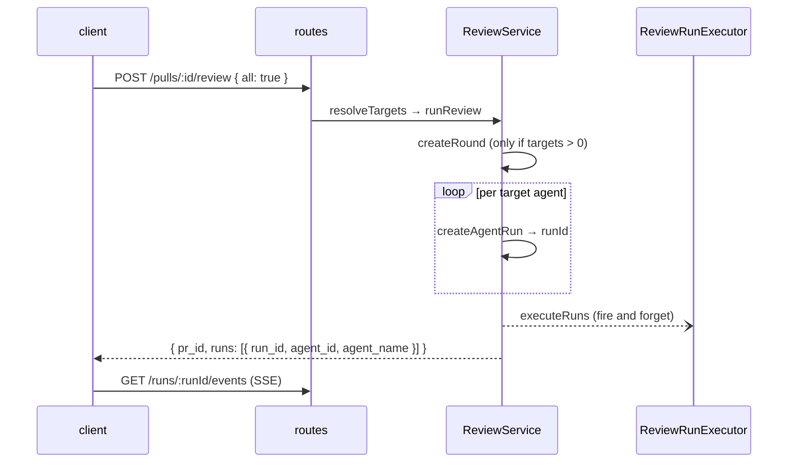

# spec — the review flow

What happens between "the user clicks Run Review" and "findings are on screen",
stated as a contract. Each numbered invariant below is behaviour something else
already depends on — a test, the UI, or the CI runner — so changing it is a
breaking change, not a refactor.

Architecture context: [`../docs/architecture.md`](../docs/architecture.md).
The pure engine this flow calls into is specified in
[`../../reviewer-core/specs/review-contract.md`](../../reviewer-core/specs/review-contract.md).

## Endpoints

All of `modules/reviews/routes.ts`:

| Method | Path | Purpose |
|---|---|---|
| POST | `/pulls/:id/review` | start a review; body `{ agentId? , all? }`, empty body allowed |
| GET | `/runs/:id/events` | SSE stream of run events (replay buffer, then live) |
| GET | `/runs/:id/trace` | the single run-trace document |
| GET | `/pulls/:id/runs` | full run history, any status |
| GET | `/pulls/:id/runs/active` | in-flight runs — the server is the source of truth |
| POST | `/runs/:id/cancel` | request cancellation of an in-flight run |
| DELETE | `/runs/:id` | drop a run from history (+ its trace and its review) |
| GET | `/pulls/:id/reviews` | persisted reviews with their findings embedded |
| DELETE | `/reviews/:id` | drop one review (findings cascade) |
| POST | `/findings/:id/accept`, `/findings/:id/dismiss` | act on a finding |

`POST /pulls/:id/review` carries a tighter rate limit (10/min) than the global
120/min, because one call can fan out to several expensive model runs. The SSE
route opts out of rate limiting entirely — it is one long-lived connection, not
burst traffic.

## Starting a review

1. **Target resolution.** `all: true` runs every *enabled* agent in the
   workspace; `agentId` runs exactly one. Neither → `400 invalid_run_request`.
2. **One round per call.** `multi_agent_runs` (the "round") groups everything a
   single click started, so the UI can total what one review cost rather than
   reporting whichever agent finished last. The round is created **only when
   there is at least one target** — `all: true` against zero enabled agents must
   not leave an orphan round behind.
3. **Run rows exist before the work does.** Every `agent_runs` row is inserted
   up front so `run_id` can be returned immediately; the client stores it and
   subscribes to SSE while the review is still assembling its prompt.
4. **Execution is fire-and-forget.** The HTTP response returns as soon as the
   ids exist. Reviews are persisted as each agent finishes; the client refetches
   when the stream says `done`. A test that drives `runReview` can therefore
   only assert on creation-time facts without flaking — anything derived from a
   finished run belongs in a test that inserts `agent_runs` rows directly.
5. **Agents fail independently.** One agent throwing does not abort the others,
   and the background crash handler logs rather than rejecting the response that
   already went out.

## What one run does

`modules/reviews/run-executor.ts`, per agent:

1. **Resolve context (best-effort).** When repo-intel is on — `REPO_INTEL_ENABLED`
   globally *and* `agent.repo_intel` per agent — the executor builds a callers
   digest, a repo map and a high-blast-radius note. Every one of these is
   wrapped so a failure or an unindexed repo logs and continues; the prompt
   simply omits the section and the review degrades to diff-only. **Enrichment
   never fails a run.**
2. **Call the engine.** `reviewPullRequest(...)` from `@devdigest/reviewer-core`
   receives the system prompt, model, parsed diff, the injected `LLMProvider`,
   the agent's `strategy`, and the optional context slots. The server owns I/O;
   the engine owns the pipeline.
3. **Persist.** `insertReview` (kind `'review'`, with `run_id`), then
   `insertFindings` for the findings that survived grounding.
4. **Mark the commit.** `markReviewed(pull.id, pull.headSha)` records which SHA
   this review ran against — the input to the PR list's status derivation.
5. **Count blockers deterministically.** `countBlockers(findings, agent.ci_fail_on)`
   — severity against the agent's gate, **not** the model's self-reported
   verdict. This is what the timeline colours on.
6. **Close the run.** `completeAgentRun` writes status, duration, tokens, cost,
   findings count, grounding summary, score and blockers; then one `run_traces`
   document is written for the whole run.

### Invariants

1. **Grounding is mandatory and the score follows it.** Findings that do not cite
   a line present in the diff are dropped before persistence, and the score is
   recomputed from the survivors. A stored review can never contain a finding the
   gate rejected, and its score always matches its findings.
2. **A failed run writes `cost_usd: null`, never `0`.** The failure path zeroes
   tokens, and copying that symmetry to cost would report a crashed run as free.
   `null` means unknown; `0` means a genuinely free model. Every cost column stays
   nullable so the UI can render an em dash.
3. **`reviews.run_id` has no foreign key.** Deleting a run therefore deletes its
   reviews explicitly, in `deleteAgentRun` — dropping a run row alone would
   orphan findings that the timeline can no longer reach.
4. **Cancellation is cooperative.** `runBus.isCancelled(runId)` is checked before
   every chunk call, so a cancelled run stops at the next checkpoint rather than
   mid-request. Cancellation cannot un-spend a call already in flight.
5. **Orphans are reaped at boot, not lazily.** See
   [`../docs/architecture.md`](../docs/architecture.md); the assumption is one API
   instance per database.
6. **Every prompt sent produces one content-free `prompt.assembled` record, on
   stdout only.** Reviewer chunks and the intent classifier each log section
   names, trust source, sizes, provider/model and ids (`round_id`, `run_id` /
   `run_ids`, `request_id`) — never a secret, diff line or spec/skill body. It goes
   to the pino logger, never through `RunLogger` (which publishes to the browser),
   and building or emitting it never fails a run. `PROMPT_LOG=off|summary|verbose`
   controls it; `verbose` needs `NODE_ENV=development`. The run trace is unchanged:
   `run_traces.prompt_assembly` still stores the full assembly.

## Derived reads

These are computed on read from `reviews` / `findings` / `agent_runs` — there is
no denormalised rollup table, and the PR list is small enough that one `IN` query
per column is cheaper than maintaining one.

| Column | Rule |
|---|---|
| `status` | `merged` / `closed` keep GitHub's state. Open PRs derive: never reviewed **or** head moved since the last review → `needs_review`; current head reviewed but untouched for `STALE_DAYS` → `stale`; else `reviewed`. |
| `score` | the **latest** review's score (newest-first, first seen per PR wins). |
| `cost_usd` | **lifetime**: `SUM(cost_usd)` over every `status='done'` run of the PR, across all rounds. Failed runs never reached a model, so they are excluded. Postgres `sum()` skips NULLs and yields NULL when none remain — exactly the "partial sum, or nothing known" rule this column needs. |
| `findings_by_severity` | **latest review per agent**: for every agent that ever ran on the PR only its newest `kind='review'` review counts, and the agents are then summed — so re-running one agent replaces that agent's contribution rather than adding to it. The unit is the agent's latest *review*, not its latest run: a run that failed wrote no review, so the agent's last real result still stands. Reviews with no `agent_id` form one bucket per PR. Counted per severity in SQL over the chosen review ids (`pickLatestReviewIds`). Accepted and dismissed findings still count — the column reports what the agents *found*, not what is still open. |

**These two columns are deliberately asymmetric.** `cost_usd` is money spent, so it
only ever grows; `findings_by_severity` is the current picture, so it can shrink
when an agent is re-run and finds less. The PR detail page's severity counters
(`FindingsSummary`) stay lifetime — every run is on screen there — so they do not
have to match the list.

Two null rules that are easy to get backwards:

- `cost_usd` is `null` when nothing is known (no completed run, or no run on a
  priced model) and `0` only when a model genuinely costs nothing.
- `findings_by_severity` is `null` when the PR has **no review at all**, and
  all-zero when it was reviewed and came back clean. Both render as an em dash,
  but only the payload keeps them apart.

Because `findings` carries no `workspace_id`, the severity rollup joins `reviews`
and scopes on `reviews.workspace_id`. That join is the tenancy boundary.

## Tests that pin this

Per [`../../TESTING.md`](../../TESTING.md) — typological, not exhaustive:

| Layer | File | Pins |
|---|---|---|
| integration | `test/reviews.it.test.ts` | the real run lifecycle incl. grounding |
| integration | `test/pulls-cost.it.test.ts` | lifetime cost: rounds, failed runs, unpriced models, free models |
| integration | `test/pulls-findings.it.test.ts` | latest-review-per-agent severity tally: re-runs replace, agents sum, failed run keeps last review, dismissed included, clean vs never reviewed, PR isolation |
| unit | `test/pulls-status.test.ts` | status derivation, aggregate coercion, severity folding, latest-review selection |
